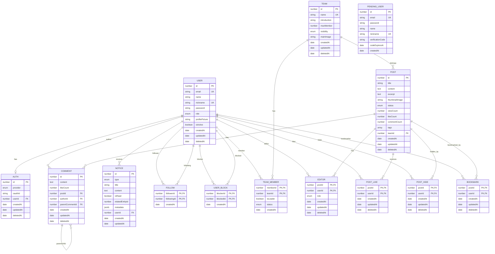

# TULOG Server - Entity Relationship Diagram (ERD)

## 엔터티 개요

TULOG 서버는 개인 블로그와 팀 블로그 기능을 제공하는 플랫폼으로, 다음과 같은 주요 엔터티들로 구성됩니다.

## 핵심 엔터티

### 1. User (사용자)
- **PK**: id (number)
- **Fields**: email, name, nickname, password, role, profilePicture, isActive
- **Enums**: UserRole (USER, ADMIN, SUPER_ADMIN)
- **Constraints**: Unique email/nickname (non-deleted users only)

### 2. Auth (인증)
- **PK**: id (number)
- **Fields**: provider, oauthId, userId
- **Enums**: AuthProvider (GOOGLE, LOCAL)
- **Relationship**: OneToOne with User

### 3. Team (팀)
- **PK**: id (number)
- **Fields**: name, introduction, maxMember, visibility, mainImage
- **Enums**: TeamVisibility (ONLY_INVITE, INVITE_AND_REQUEST)
- **Constraints**: Unique name

### 4. Post (게시물)
- **PK**: id (number)
- **Fields**: title, content, excerpt, thumbnailImage, status, viewCount, likeCount, commentCount, tags, teamId
- **Enums**: PostStatus (DRAFT, PUBLIC, PRIVATE)
- **Note**: teamId가 NULL인 경우 개인 블로그

## 관계형 엔터티 (Many-to-Many)

### 5. Follow (팔로우)
- **복합 PK**: followerId + followingId
- **Fields**: createdAt
- **Relationship**: User ↔ User (팔로워 ↔ 팔로잉)

### 6. UserBlock (사용자 차단)
- **복합 PK**: blockerId + blockedId
- **Fields**: createdAt
- **Relationship**: User ↔ User (차단자 ↔ 피차단자)

### 7. TeamMember (팀 멤버)
- **복합 PK**: memberId + teamId
- **Fields**: isLeader, createdAt, status
- **Enums**: TeamMemberStatus (JOINED, INVITED, PENDING)
- **Relationship**: User ↔ Team

### 8. Editor (편집자)
- **복합 PK**: postId + userId
- **Fields**: role, createdAt, updatedAt, deletedAt
- **Enums**: EditorRole (OWNER, EDITOR, VIEWER)
- **Relationship**: Post ↔ User (팀 블로그 편집 권한)

### 9. PostLike (게시물 좋아요)
- **복합 PK**: postId + userId
- **Fields**: createdAt, updatedAt, deletedAt
- **Relationship**: Post ↔ User

### 10. PostHide (게시물 숨김)
- **복합 PK**: postId + userId
- **Fields**: createdAt, updatedAt, deletedAt
- **Relationship**: Post ↔ User

### 11. Bookmark (북마크)
- **복합 PK**: postId + userId
- **Fields**: createdAt, updatedAt, deletedAt
- **Relationship**: Post ↔ User

### 12. Comment (댓글)
- **PK**: id (number)
- **Fields**: content, likeCount, postId, authorId, parentCommentId
- **Relationship**: 
  - Post → Comment (게시물의 댓글)
  - User → Comment (댓글 작성자)
  - Comment → Comment (대댓글 구조)

## 기타 엔터티

### 13. Notice (알림)
- **PK**: id (number)
- **Fields**: type, title, content, isRead, relatedEntityId, metadata, userId
- **Enums**: NoticeType (FOLLOW, TEAM_INVITE, TEAM_JOIN, TEAM_LEAVE, TEAM_KICK, SYSTEM)
- **Relationship**: User → Notice

### 14. PendingUser (가입 대기)
- **PK**: id (number)
- **Fields**: email, password, name, nickname, verificationCode, codeExpiresAt
- **Purpose**: 이메일 인증 대기 중인 회원가입 정보

## 엔터티 관계도 (Mermaid)

## 주요 비즈니스 로직

### 1. 개인 vs 팀 블로그
- **개인 블로그**: Post.teamId = NULL
- **팀 블로그**: Post.teamId != NULL, Editor를 통해 편집 권한 관리

### 2. 편집 권한
- **OWNER**: 게시물 소유자 (생성자)
- **EDITOR**: 편집 권한이 있는 사용자
- **VIEWER**: 조회만 가능한 사용자

### 3. 소프트 삭제
- Common 엔터티를 상속받는 엔터티들은 deletedAt을 통한 소프트 삭제 지원
- User, Team, Post, Editor, PostLike, PostHide, Bookmark, Comment

### 4. 복합 Primary Key
- 모든 Many-to-Many 관계 테이블은 복합 PK 사용
- 별도의 id 컬럼 없이 관련 FK들이 PK 역할

### 5. 댓글 계층 구조
- Comment.parentCommentId를 통한 대댓글 구조
- 무한 depth 지원 가능

### 6. 알림 시스템
- Notice 엔터티를 통한 사용자 알림
- metadata 필드를 통한 확장 가능한 알림 정보 저장

## 인덱스 전략

### User
- Unique: email (deletedAt IS NULL)
- Unique: nickname (deletedAt IS NULL)

### Notice
- Composite: (userId, createdAt) - 사용자별 알림 조회
- Composite: (userId, isRead) - 읽지 않은 알림 조회

### 복합 PK 테이블
- 자동으로 복합 PK에 대한 인덱스 생성
- 필요에 따라 개별 FK에 대한 인덱스 추가 고려