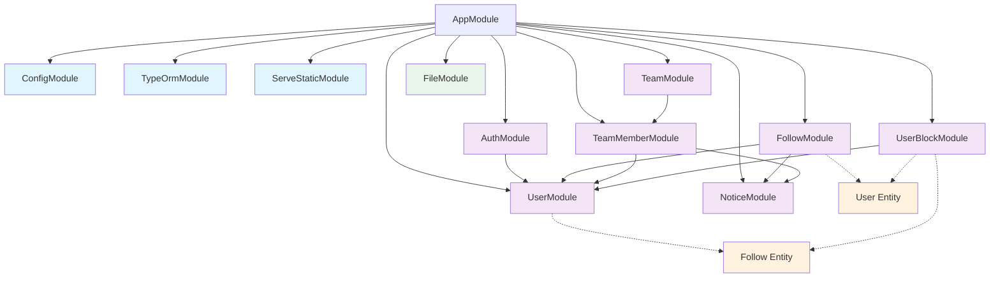

# Module Dependencies Visualization

> TULOG 서버의 NestJS 모듈 간 의존성 관계를 시각화한 문서입니다.

## 📋 목차

-   [모듈 개요](#모듈-개요)
-   [의존성 다이어그램](#의존성-다이어그램)
-   [모듈별 상세 분석](#모듈별-상세-분석)
-   [순환 의존성 검사](#순환-의존성-검사)

---

## 모듈 개요

### 전체 모듈 구조

```
📦 AppModule (루트)
├── 🔧 ConfigModule (전역)
├── 🗃️ TypeOrmModule (전역)
├── 📁 ServeStaticModule
├── 👤 UserModule
├── 🔐 AuthModule
├── 👥 FollowModule
├── 🏢 TeamModule
├── 👨‍👩‍👧‍👦 TeamMemberModule
├── 🚫 UserBlockModule
├── 🔔 NoticeModule
└── 📄 FileModule
```

---

## 의존성 다이어그램

### 🔄 모듈 간 Import 관계



### 📊 의존성 레벨별 분류

#### Level 0 - 핵심 인프라

-   `ConfigModule` - 전역 설정 관리
-   `TypeOrmModule` - 데이터베이스 연결
-   `ServeStaticModule` - 정적 파일 서빙

#### Level 1 - 기본 모듈 (의존성 없음)

-   `UserModule` - 사용자 관리
-   `NoticeModule` - 알림 시스템
-   `FileModule` - 파일 업로드

#### Level 2 - 단일 의존성 모듈

-   `AuthModule` → `UserModule`
-   `UserBlockModule` → `UserModule`

#### Level 3 - 다중 의존성 모듈

-   `FollowModule` → `UserModule`, `NoticeModule`
-   `TeamMemberModule` → `UserModule`, `NoticeModule`

#### Level 4 - 복합 의존성 모듈

-   `TeamModule` → `TeamMemberModule` (간접적으로 User, Notice 의존)

---

## 모듈별 상세 분석

### 👤 UserModule

**역할**: 사용자 정보 관리의 핵심 모듈

```typescript
// Dependencies: None
// Exports: UserService, UserRepository
// Entities: User, Follow
```

**특징**:

-   다른 모듈들이 가장 많이 의존하는 기본 모듈
-   Follow 엔티티도 함께 관리 (사용자 목록 조회 최적화)

---

### 🔐 AuthModule

**역할**: 인증 및 JWT 토큰 관리

```typescript
// Dependencies: UserModule
// Exports: AuthService, AuthRepository, PendingUserRepository
// Entities: Auth, PendingUser
```

**특징**:

-   JWT, Google OAuth 통합 인증 제공
-   임시 사용자(PendingUser) 관리

---

### 👥 FollowModule

**역할**: 사용자 팔로우 시스템

```typescript
// Dependencies: UserModule, NoticeModule
// Exports: FollowService, FollowRepository
// Entities: Follow, User
```

**특징**:

-   팔로우 시 자동 알림 생성
-   사용자 정보와 긴밀하게 연동

---

### 🏢 TeamModule

**역할**: 팀 정보 관리

```typescript
// Dependencies: TeamMemberModule
// Exports: TeamService, TeamRepository
// Entities: Team
```

**특징**:

-   TeamMemberModule을 통해 팀원 관리 위임
-   팀 생성, 수정, 조회 담당

---

### 👨‍👩‍👧‍👦 TeamMemberModule

**역할**: 팀원 관리 및 팀 가입/초대 시스템

```typescript
// Dependencies: UserModule, NoticeModule
// Exports: TeamMemberService, TeamMemberRepository
// Entities: TeamMember
```

**특징**:

-   팀 초대/가입 시 자동 알림 생성
-   복잡한 비즈니스 로직 (권한, 상태 관리)

---

### 🚫 UserBlockModule

**역할**: 사용자 차단 시스템

```typescript
// Dependencies: UserModule
// Exports: UserBlockService, UserBlockRepository
// Entities: UserBlock, User, Follow
```

**특징**:

-   차단 시 팔로우 관계도 함께 처리
-   다중 엔티티 관리

---

### 🔔 NoticeModule

**역할**: 알림 시스템 (독립적)

```typescript
// Dependencies: None
// Exports: NoticeService, NoticeRepository
// Entities: Notice
```

**특징**:

-   다른 모듈들이 의존하는 서비스 모듈
-   알림 타입별 관리 (FOLLOW, TEAM_INVITE, etc.)

---

### 📄 FileModule

**역할**: 파일 업로드 처리

```typescript
// Dependencies: None
// Exports: None (Controller만 존재)
// Entities: None
```

**특징**:

-   단순 파일 업로드 처리
-   다른 모듈과 독립적 운영

---

## 순환 의존성 검사

### ✅ 현재 상태: 순환 의존성 없음

#### 의존성 체인 분석:

1. **User ← Auth**: 단방향 의존성 ✓
2. **User ← Follow ← Notice**: 선형 의존성 ✓
3. **User ← TeamMember ← Team**: 선형 의존성 ✓
4. **Notice ← Follow, TeamMember**: 다대일 의존성 ✓
5. **User ← Block**: 단방향 의존성 ✓

#### 잠재적 위험 요소:

-   **Team ↔ TeamMember**: 현재는 Team → TeamMember 단방향이지만, 향후 TeamMember에서 Team 정보가 필요할 경우 주의 필요
-   **User ↔ Follow**: Follow 엔티티가 UserModule에서 관리되므로 안전

---

## 🚨 개발 가이드라인

### DO ✅

-   새로운 모듈 추가 시 의존성 레벨 고려
-   알림이 필요한 기능은 NoticeModule 활용
-   사용자 관련 기능은 UserModule을 기반으로 구축

### DON'T ❌

-   순환 의존성 생성 금지
-   NoticeModule이나 UserModule에 다른 비즈니스 모듈 의존성 추가 금지
-   엔티티 중복 관리 지양

### 📈 확장 시 고려사항

-   새로운 알림 타입 추가 시: NoticeModule 확장
-   새로운 사용자 관련 기능: UserModule 확장 또는 새 모듈에서 UserModule 의존
-   팀 관련 기능 확장: TeamModule 또는 TeamMemberModule 활용
