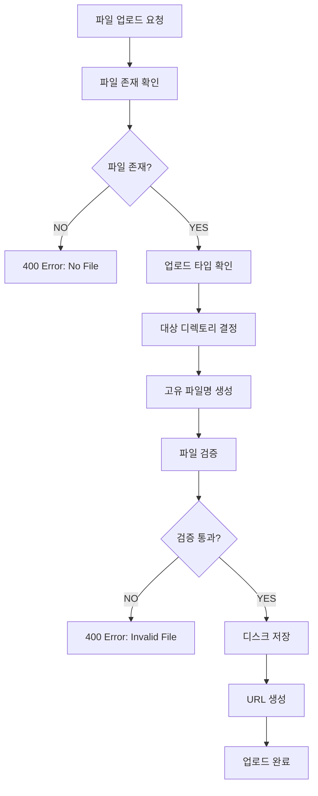

# File Upload System Pipeline

## 🏗️ 시스템 개요

파일 업로드 시스템은 TULOG의 미디어 콘텐츠 관리를 담당하는 핵심 인프라 기능입니다. 사용자 프로필 이미지와 팀 이미지 업로드를 안전하고 효율적으로 처리합니다.

### 📋 핵심 기능

-   **타입별 업로드**: 사용자 프로필, 팀 이미지 분류 저장
-   **파일 검증**: 파일 타입, 크기, 확장자 검증
-   **안전한 저장**: 고유 파일명 생성으로 충돌 방지
-   **URL 생성**: 접근 가능한 파일 URL 자동 생성
-   **경로 관리**: 타입별 디렉토리 구조화

---

## 🎯 비즈니스 규칙

### 파일 타입 분류

```typescript
// 쿼리 파라미터로 업로드 타입 지정
const type = req.query.type;
let folder = "uploads/others";

if (type === "user") folder = "uploads/user-profile";
else if (type === "team") folder = "uploads/team-image";
```

### 파일명 생성 규칙

```typescript
// 고유한 파일명 생성으로 충돌 방지
const uniqueSuffix = Date.now() + "-" + Math.round(Math.random() * 1e9);
const filename = `${uniqueSuffix}${extname(file.originalname)}`;
```

### URL 생성 패턴

```typescript
// 환경변수 기반 접근 가능한 URL 생성
const fileUrl = `${process.env.SERVER_URL}/uploads/${folder}/${file.filename}`;
```

---

## 🔄 파일 업로드 파이프라인



### 상세 구현

```typescript
@Post('upload')
@UseInterceptors(
    FileInterceptor('file', {
        storage: diskStorage({
            destination: (req, file, cb) => {
                // 1. 업로드 타입에 따른 디렉토리 결정
                const type = req.query.type;
                let folder = 'uploads/others';

                if (type === 'user') folder = 'uploads/user-profile';
                else if (type === 'team') folder = 'uploads/team-image';

                cb(null, folder);
            },
            filename: (req, file: Express.Multer.File, cb) => {
                // 2. 고유 파일명 생성 (타임스탬프 + 랜덤)
                const uniqueSuffix = Date.now() + '-' + Math.round(Math.random() * 1e9);
                cb(null, `${uniqueSuffix}${extname(file.originalname)}`);
            },
        }),
    }),
)
async upload(
    @UploadedFile() file: Express.Multer.File,
    @Query('type') type: string,
) {
    // 3. 파일 존재 확인
    if (!file) {
        throw new BadRequestException('No file uploaded');
    }

    // 4. 폴더명 결정 및 URL 생성
    let folder = 'user-profile';
    if (type === 'team') folder = 'team-image';

    const fileUrl = `${process.env.SERVER_URL}/uploads/${folder}/${file.filename}`;

    // 5. 업로드 결과 반환
    return { url: fileUrl };
}
```

---

## 📂 파일 저장 구조

### 디렉토리 구조

```
uploads/
├── user-profile/          # 사용자 프로필 이미지
│   ├── 1642841234567-123456789.jpg
│   ├── 1642841234568-234567890.png
│   └── ...
├── team-image/            # 팀 이미지
│   ├── 1642841234569-345678901.jpg
│   ├── 1642841234570-456789012.png
│   └── ...
└── others/                # 기타 파일
    ├── 1642841234571-567890123.pdf
    └── ...
```

### 파일명 생성 로직

```typescript
// 파일명 구성: [타임스탬프]-[랜덤숫자].[확장자]
// 예: 1642841234567-123456789.jpg

filename: (req, file: Express.Multer.File, cb) => {
    const timestamp = Date.now(); // 현재 시간 (밀리초)
    const randomSuffix = Math.round(Math.random() * 1e9); // 9자리 랜덤 숫자
    const extension = extname(file.originalname); // 원본 파일 확장자

    const uniqueFilename = `${timestamp}-${randomSuffix}${extension}`;
    cb(null, uniqueFilename);
};
```

---

## 🛡️ 보안 및 검증

### 파일 타입 검증

```typescript
// Multer 미들웨어에서 파일 타입 필터링 (확장 가능)
fileFilter: (req, file, cb) => {
    const allowedMimes = ["image/jpeg", "image/jpg", "image/png", "image/gif", "image/webp"];

    if (allowedMimes.includes(file.mimetype)) {
        cb(null, true);
    } else {
        cb(new BadRequestException("Invalid file type"), false);
    }
};
```

### 파일 크기 제한

```typescript
// 파일 크기 제한 설정 (5MB 예시)
limits: {
    fileSize: 5 * 1024 * 1024, // 5MB
    files: 1                    // 한 번에 하나의 파일만
}
```

### 파일명 보안

```typescript
// 고유 파일명으로 보안 위험 방지
// - 원본 파일명 사용 안함 (경로 조작 공격 방지)
// - 타임스탬프 + 랜덤으로 예측 불가능한 파일명
// - 확장자는 원본 유지하여 파일 타입 보존
```

---

## 🔄 클라이언트 연동

### 프론트엔드 업로드

```typescript
// 사용자 프로필 이미지 업로드
export const uploadUserProfilePicture = async (file: File) => {
    const formData = new FormData();
    formData.append("file", file);

    const response = await apiClient.post("/api/files/upload?type=user", formData, {
        headers: {
            "Content-Type": "multipart/form-data",
        },
    });

    return response.data.data.url; // 업로드된 파일 URL 반환
};

// 팀 이미지 업로드
export const uploadTeamImage = async (file: File) => {
    const formData = new FormData();
    formData.append("file", file);

    const response = await apiClient.post("/api/files/upload?type=team", formData, {
        headers: {
            "Content-Type": "multipart/form-data",
        },
    });

    return response.data.data.url;
};
```

### UI 컴포넌트 연동

```typescript
// 프로필 설정 페이지에서 이미지 업로드
const handleImageChange = (e: React.ChangeEvent<HTMLInputElement>) => {
    const selectedFile = e.target.files?.[0];
    if (selectedFile) {
        setFile(selectedFile);

        // 미리보기 URL 생성
        const previewUrl = URL.createObjectURL(selectedFile);
        setPreviewUrl(previewUrl);
        setIsDirty(true);
    }
};

const handleSubmit = async (e: React.FormEvent<HTMLFormElement>) => {
    e.preventDefault();

    let profilePicture: string | undefined;

    // 파일이 있으면 업로드 수행
    if (file) {
        try {
            profilePicture = await uploadUserProfilePicture(file);
        } catch (err) {
            console.error("Failed:", err);
            alert("Failed to upload image.");
            return;
        }
    }

    // 업로드된 URL을 사용자 정보 업데이트에 포함
    const payload: any = {};
    if (profilePicture && profilePicture !== currentUser.profilePicture) {
        payload.profilePicture = profilePicture;
    }

    await updateCurrentUser(payload);
};
```

---

## 📊 성능 최적화

### 스토리지 최적화

```typescript
// 디스크 저장소 설정
storage: diskStorage({
    destination: (req, file, cb) => {
        // 날짜별 서브 디렉토리 생성 (선택적)
        const today = new Date().toISOString().split("T")[0]; // YYYY-MM-DD
        const type = req.query.type;
        let folder = `uploads/others/${today}`;

        if (type === "user") folder = `uploads/user-profile/${today}`;
        else if (type === "team") folder = `uploads/team-image/${today}`;

        // 디렉토리 자동 생성
        ensureDirectoryExists(folder);
        cb(null, folder);
    },
});
```

### 이미지 최적화 (확장 가능)

```typescript
// Sharp 라이브러리를 사용한 이미지 리사이징 (향후 구현 가능)
import * as sharp from 'sharp';

async optimizeImage(file: Express.Multer.File): Promise<Buffer> {
    return await sharp(file.buffer)
        .resize(800, 800, {
            fit: 'inside',
            withoutEnlargement: true
        })
        .jpeg({ quality: 85 })
        .toBuffer();
}
```

### CDN 연동 준비

```typescript
// 환경변수로 CDN URL 설정 가능
const baseUrl = process.env.CDN_URL || process.env.SERVER_URL;
const fileUrl = `${baseUrl}/uploads/${folder}/${file.filename}`;
```

---

## 🚨 에러 처리 및 예외 상황

### 주요 예외 상황

| 에러 코드 | 상황                    | 메시지              |
| --------- | ----------------------- | ------------------- |
| `400`     | 파일 없음               | No file uploaded    |
| `400`     | 지원하지 않는 파일 타입 | Invalid file type   |
| `413`     | 파일 크기 초과          | File too large      |
| `500`     | 저장소 오류             | Failed to save file |

### 예외 처리 구현

```typescript
// Multer 에러 처리
app.use((error: any, req: Request, res: Response, next: NextFunction) => {
    if (error instanceof MulterError) {
        if (error.code === "LIMIT_FILE_SIZE") {
            return res.status(413).json({
                success: false,
                message: "File too large. Maximum size is 5MB.",
            });
        }
        if (error.code === "LIMIT_UNEXPECTED_FILE") {
            return res.status(400).json({
                success: false,
                message: "Unexpected file field.",
            });
        }
    }

    next(error);
});
```

### 클라이언트 에러 처리

```typescript
try {
    const imageUrl = await uploadUserProfilePicture(file);
    setProfileImage(imageUrl);
} catch (error: any) {
    const message = error?.response?.data?.message || "Upload failed";

    if (error?.response?.status === 413) {
        alert("File is too large. Please choose a smaller image.");
    } else if (error?.response?.status === 400) {
        alert("Invalid file format. Please choose an image file.");
    } else {
        alert(`Upload failed: ${message}`);
    }
}
```

---

## 🔮 확장 가능성

### 향후 개선 사항

1. **이미지 처리**: 자동 리사이징, 썸네일 생성
2. **다중 파일 업로드**: 갤러리, 첨부파일 지원
3. **클라우드 스토리지**: AWS S3, Google Cloud Storage 연동
4. **CDN 통합**: CloudFront, CloudFlare 등과 연동
5. **메타데이터 관리**: 파일 정보, EXIF 데이터 저장

### 스토리지 확장

```typescript
// 클라우드 스토리지 추상화 (향후 구현)
interface StorageProvider {
    upload(file: Express.Multer.File, path: string): Promise<string>;
    delete(path: string): Promise<boolean>;
    getUrl(path: string): string;
}

class S3StorageProvider implements StorageProvider {
    async upload(file: Express.Multer.File, path: string): Promise<string> {
        // S3 업로드 로직
    }
}

class LocalStorageProvider implements StorageProvider {
    async upload(file: Express.Multer.File, path: string): Promise<string> {
        // 현재 로컬 저장소 로직
    }
}
```

### 파일 관리 시스템

```typescript
// 파일 메타데이터 엔티티 (향후 구현)
@Entity("file")
export class File {
    @PrimaryGeneratedColumn()
    id: number;

    @Column()
    originalName: string;

    @Column()
    filename: string;

    @Column()
    mimetype: string;

    @Column()
    size: number;

    @Column()
    path: string;

    @Column()
    url: string;

    @CreateDateColumn()
    createdAt: Date;
}
```

---

## 📝 요약

파일 업로드 시스템은 다음과 같은 핵심 기능을 제공합니다:

1. **타입별 관리**: 사용자 프로필, 팀 이미지 등 용도별 분류 저장
2. **보안성**: 고유 파일명 생성으로 충돌 방지 및 보안 강화
3. **확장성**: 다양한 스토리지 백엔드 지원 준비
4. **사용자 경험**: 간단한 API로 쉬운 클라이언트 연동
5. **성능**: 효율적인 파일 저장 및 URL 생성

이러한 견고한 파일 업로드 시스템으로 TULOG의 미디어 콘텐츠를 안전하고 효율적으로 관리할 수 있습니다.
