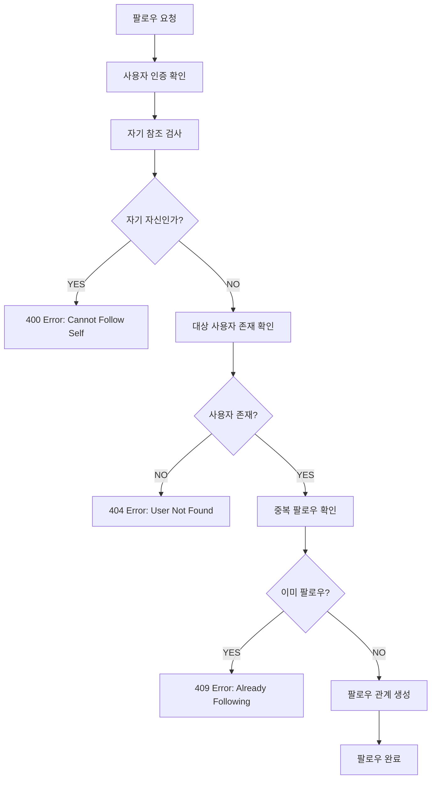
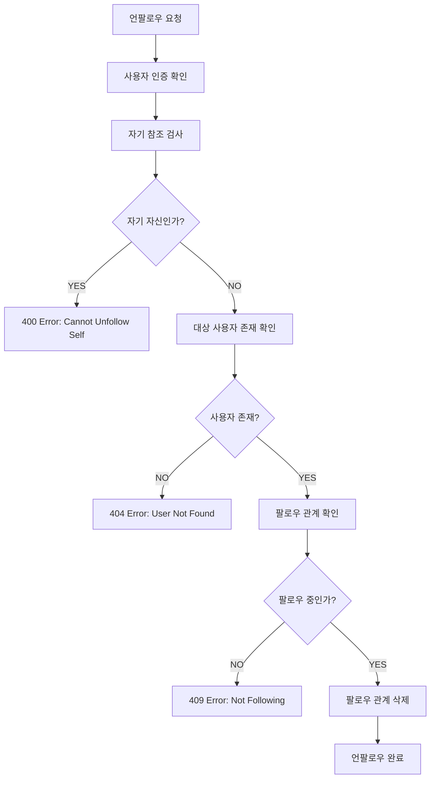
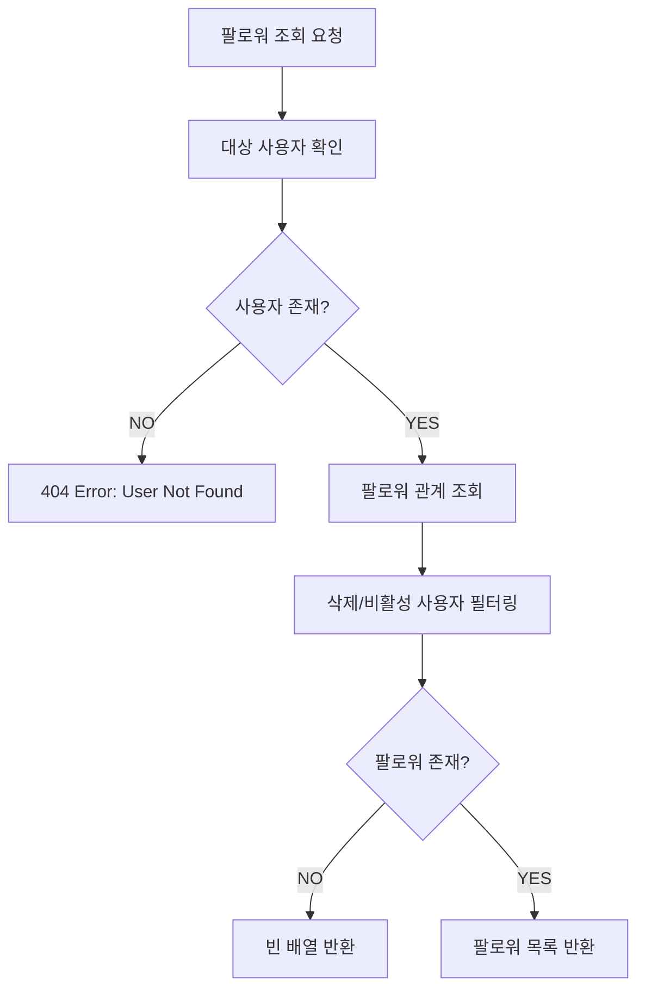

# Follow System Pipeline

## 🏗️ 시스템 개요

팔로우 시스템은 TULOG의 핵심 소셜 기능으로, 사용자 간의 연결과 상호작용을 관리합니다. 복잡한 데이터 정합성 보장과 삭제된 사용자 처리 로직을 포함합니다.

### 📋 핵심 기능

-   **팔로우/언팔로우**: 사용자 간 팔로우 관계 관리
-   **팔로워/팔로잉 조회**: 관계 목록 조회 및 필터링
-   **데이터 정합성**: 삭제/비활성 사용자 자동 제외
-   **중복 방지**: 동일 관계 중복 생성 방지
-   **자기 참조 방지**: 자기 자신 팔로우 차단

---

## 🎯 비즈니스 규칙

### 팔로우 제약사항

```typescript
// 자기 자신은 팔로우할 수 없음
if (followerId === followId) {
    throw new BadRequestException("You cannot follow yourself");
}

// 이미 팔로우한 사용자는 중복 팔로우 불가
if (isFollowing) {
    throw new ConflictException("You are already following this user");
}
```

### 데이터 정합성 규칙

```typescript
// 삭제되거나 비활성화된 사용자는 팔로우 목록에서 제외
.andWhere('followingUser.deletedAt IS NULL AND followingUser.isActive = true')
```

### 존재하지 않는 사용자 처리

```typescript
// 팔로우 대상 사용자가 존재하지 않으면 예외 발생
await this.userService.getUserById(followId);
```

---

## 🔄 팔로우 파이프라인



### 상세 구현

```typescript
async followUser(followerId: number, followId: number): Promise<Follow> {
    // 1. 자기 자신 팔로우 방지
    if (followerId === followId) {
        throw new BadRequestException('You cannot follow yourself');
    }

    // 2. 팔로우 대상 사용자 존재 확인 (활성 사용자만)
    await this.userService.getUserById(followId);

    // 3. 중복 팔로우 확인
    const isFollowing = await this.followRepository.isFollowing(followerId, followId);
    if (isFollowing) {
        throw new ConflictException('You are already following this user');
    }

    // 4. 팔로우 관계 생성
    return await this.followRepository.followUser(followerId, followId);
}
```

---

## 🔄 언팔로우 파이프라인



### 상세 구현

```typescript
async unfollowUser(followerId: number, followId: number): Promise<boolean> {
    // 1. 자기 자신 언팔로우 방지
    if (followerId === followId) {
        throw new BadRequestException('You cannot unfollow yourself');
    }

    // 2. 언팔로우 대상 사용자 존재 확인
    await this.userService.getUserById(followId);

    // 3. 팔로우 관계 존재 확인
    const isFollowing = await this.followRepository.isFollowing(followerId, followId);
    if (!isFollowing) {
        throw new ConflictException('You are not following this user');
    }

    // 4. 팔로우 관계 삭제
    return await this.followRepository.unfollowUser(followerId, followId);
}
```

---

## 📋 팔로워/팔로잉 조회 파이프라인

### 팔로워 목록 조회



### 상세 구현

```typescript
async getFollowers(userId: number): Promise<User[]> {
    // 1. 대상 사용자 존재 확인
    await this.userService.getUserById(userId);

    // 2. 팔로워 관계 조회 (활성 사용자만)
    const user = await this.userService.findUserByIdWithFollowers(userId);

    // 3. 팔로워가 없으면 빈 배열 반환
    if (!user) {
        return [];
    }

    // 4. 팔로워 목록 추출 및 반환
    return user.followers.map((f) => f.follower);
}
```

### 복잡한 쿼리 로직

```typescript
// Repository 레벨에서 삭제/비활성 사용자 자동 필터링
async findWithFollowersById(id: number): Promise<User | null> {
    return await this.userRepository
        .createQueryBuilder('user')
        .leftJoinAndSelect('user.followers', 'follow')
        .leftJoinAndSelect('follow.follower', 'followerUser')
        .where('user.id = :id', { id })
        .andWhere('user.deletedAt IS NULL AND user.isActive = true')
        .andWhere('followerUser.deletedAt IS NULL AND followerUser.isActive = true')
        .getOne();
}
```

---

## 🛡️ 데이터 정합성 보장

### 삭제된 사용자 처리

-   **자동 필터링**: 쿼리 레벨에서 삭제/비활성 사용자 제외
-   **관계 정리**: 사용자 삭제시 팔로우 관계도 함께 정리 (CASCADE)
-   **일관성 유지**: 모든 조회에서 동일한 필터링 규칙 적용

### 중복 방지 메커니즘

```typescript
// 복합 유니크 인덱스로 중복 방지
@Entity("follow")
@Unique(["followerId", "followingId"])
export class Follow {
    @Column()
    followerId: number;

    @Column()
    followingId: number;
}
```

### 참조 무결성

```typescript
// 외래키 제약으로 데이터 무결성 보장
@ManyToOne(() => User, { onDelete: 'CASCADE' })
follower: User;

@ManyToOne(() => User, { onDelete: 'CASCADE' })
following: User;
```

---

## 🚨 에러 처리 및 예외 상황

### 주요 비즈니스 예외

| 에러 코드 | 상황                            | 메시지                              |
| --------- | ------------------------------- | ----------------------------------- |
| `400`     | 자기 자신 팔로우 시도           | You cannot follow yourself          |
| `400`     | 자기 자신 언팔로우 시도         | You cannot unfollow yourself        |
| `404`     | 존재하지 않는 사용자            | User with ID {id} not found         |
| `409`     | 이미 팔로우한 사용자            | You are already following this user |
| `409`     | 팔로우하지 않은 사용자 언팔로우 | You are not following this user     |

### 예외 처리 전략

```typescript
// 예외 발생시 명확한 메시지와 적절한 HTTP 상태 코드 반환
try {
    await this.followService.followUser(followerId, followId);
} catch (error) {
    if (error instanceof BadRequestException) {
        // 잘못된 요청 (자기 자신 팔로우 등)
    } else if (error instanceof NotFoundException) {
        // 존재하지 않는 사용자
    } else if (error instanceof ConflictException) {
        // 중복 요청 또는 불가능한 작업
    }
}
```

---

## 📊 성능 최적화

### 쿼리 최적화

```typescript
// 인덱스 활용을 위한 복합 쿼리
@Index(['followerId', 'followingId'])
@Index(['followingId', 'followerId'])
```

### N+1 문제 해결

```typescript
// JOIN을 통한 일괄 로딩으로 N+1 문제 방지
.leftJoinAndSelect('user.followers', 'follow')
.leftJoinAndSelect('follow.follower', 'followerUser')
```

### 메모리 효율성

```typescript
// 필요한 필드만 SELECT하여 메모리 사용량 최적화
.select(['user.id', 'user.nickname', 'user.profilePicture'])
```

---

## 🔄 UI/UX 연동

### 실시간 상태 반영

```typescript
// 프론트엔드에서 팔로우 상태 즉시 반영
const [alreadyFollowing, setAlreadyFollowing] = useState<boolean>(false);

// 팔로우 여부 확인
useEffect(() => {
    if (user && myFollowings.length > 0) {
        const isFollowing = myFollowings.some((followUser) => followUser.id === user.id);
        setAlreadyFollowing(isFollowing);
    }
}, [user, myFollowings]);
```

### 사용자 경험 개선

-   **로딩 상태**: 팔로우/언팔로우 처리 중 버튼 비활성화
-   **즉시 피드백**: 성공/실패 메시지 즉시 표시
-   **상태 동기화**: 팔로우 카운트 실시간 업데이트

---

## 🔮 확장 가능성

### 향후 개선 사항

1. **팔로우 요청 시스템**: 비공개 계정에 대한 팔로우 요청
2. **뮤팅 기능**: 팔로우는 유지하되 피드에서 제외
3. **팔로우 제한**: 팔로우 수 제한 또는 스팸 방지
4. **소셜 그래프 분석**: 팔로우 네트워크 기반 추천
5. **알림 시스템**: 새 팔로워 알림

### 확장성 고려사항

-   **대용량 처리**: 팔로우 관계 데이터 파티셔닝
-   **캐싱 전략**: 인기 사용자의 팔로워 수 캐싱
-   **비동기 처리**: 대량 팔로우 작업의 백그라운드 처리

---

## 📝 요약

팔로우 시스템은 다음과 같은 복잡한 비즈니스 로직을 구현합니다:

1. **관계 무결성**: 자기 참조 방지 및 중복 관계 방지
2. **데이터 정합성**: 삭제/비활성 사용자 자동 필터링
3. **성능 최적화**: 복합 인덱스 및 JOIN 최적화
4. **사용자 경험**: 실시간 상태 반영 및 즉시 피드백
5. **확장성**: 대용량 소셜 네트워크 대응 준비

이러한 복잡성으로 인해 팔로우 시스템은 소셜 플랫폼의 핵심 기능이자 중요한 비즈니스 로직입니다.
