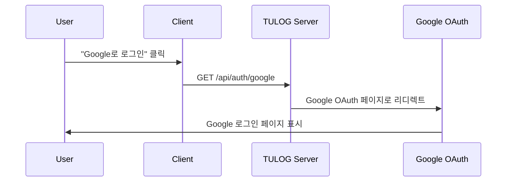
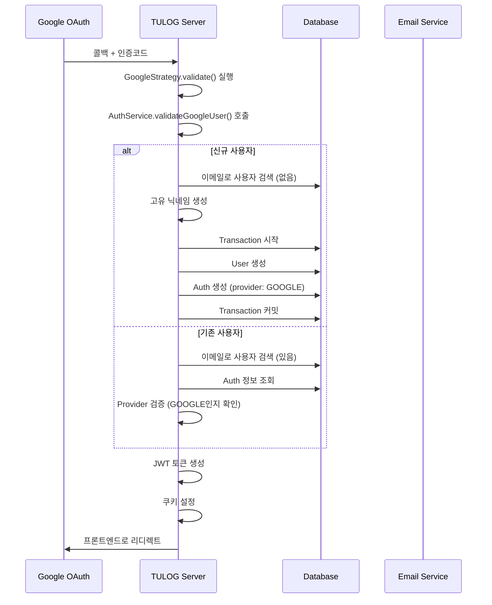
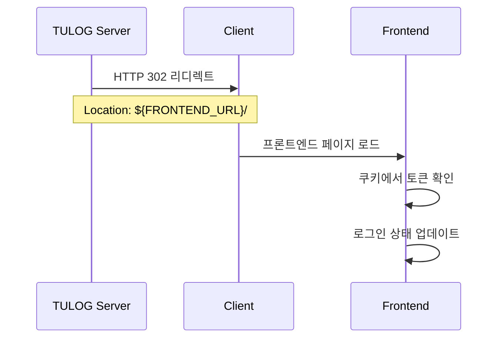

# Google OAuth Login Pipeline

Google OAuth를 통한 로그인 프로세스의 상세한 비즈니스 로직을 설명합니다.

## 📋 Overview

Google OAuth 로그인은 사용자가 Google 계정을 통해 TULOG에 로그인할 수 있도록 하는 인증 시스템입니다. 이 프로세스는 새로운 사용자 등록과 기존 사용자 로그인을 모두 처리합니다.

## 🔄 Flow Diagram

```
[Client] → [TULOG Server] → [Google OAuth] → [TULOG Server] → [Client]
    ↓           ↓               ↓               ↓            ↓
  사용자      Google로        Google         토큰생성      로그인
  클릭       리디렉트         인증완료       쿠키설정      완료
```

## 📊 Detailed Pipeline

### Phase 1: OAuth 시작

**Endpoint**: `GET /api/auth/google`



**처리 과정:**

1. **Controller 진입점**: `auth.controller.ts` → `googleAuth()`
2. **Guard 적용**: `AuthGuard('google')` + `RateLimitGuard`
3. **Google Strategy 호출**: `google.strategy.ts` 실행
4. **Google 리디렉트**: 사용자를 Google OAuth 화면으로 리디렉트

**설정값:**

-   `GOOGLE_CLIENT_ID`: Google OAuth 클라이언트 ID
-   `GOOGLE_CLIENT_SECRET`: Google OAuth 클라이언트 시크릿
-   `GOOGLE_CALLBACK_URL`: 콜백 URL (일반적으로 `/api/auth/google/callback`)
-   **Scope**: `['email', 'profile']`

---

### Phase 2: Google 인증 및 콜백

**Endpoint**: `GET /api/auth/google/callback`



**처리 과정:**

#### 2-1. Google Strategy 검증

```typescript
// google.strategy.ts - validate() 메소드
const googleUser = {
    id: profile.id,
    email: emails[0]?.value,
    firstName: name?.givenName,
    lastName: name?.familyName,
    picture: photos[0]?.value,
};

const result = await authService.validateGoogleUser(googleUser);
```

#### 2-2. 사용자 검증 및 처리 (AuthService)

**신규 사용자인 경우:**

```typescript
// 1. 이메일로 기존 사용자 확인
const user = await this.userService.findUserByEmail(email);

if (!user) {
    // 2. 고유 닉네임 생성 (최대 5번 시도)
    let randomNickname = email.split("@")[0];
    let attempt = 0;

    while (attempt < 5) {
        const existing = await this.userService.findUserIncludingNoActiveByNickname(randomNickname);
        if (!existing) break;

        const randomSuffix = Math.floor(Math.random() * 99999) + 1;
        randomNickname = `${nickname}${randomSuffix}`;
        attempt++;
    }

    // 3. 트랜잭션으로 사용자 및 인증 정보 생성
    const queryRunner = this.dataSource.createQueryRunner();
    await queryRunner.connect();
    await queryRunner.startTransaction();

    try {
        // 사용자 생성
        const createdUser = await queryRunner.manager.save(User, {
            email,
            name: `${firstName} ${lastName}`.trim(),
            nickname: randomNickname,
            profilePicture: picture,
            isActive: true,
        });

        // 인증 정보 생성
        await queryRunner.manager.save(Auth, {
            oauthId: id,
            provider: AuthProvider.GOOGLE,
            user: createdUser,
        });

        await queryRunner.commitTransaction();
        return this.generateAuthResult(createdUser);
    } catch (error) {
        await queryRunner.rollbackTransaction();
        throw new InternalServerErrorException("Failed Google OAuth registration");
    }
}
```

**기존 사용자인 경우:**

```typescript
// 1. Auth 정보 조회
const auth = await this.getAuthByUserId(user.id);

// 2. Provider 검증
if (auth.provider !== AuthProvider.GOOGLE) {
    throw new BadRequestException(`"${email}" already exists with a different login method.`);
}

// 3. 인증 결과 생성
return this.generateAuthResult(user);
```

#### 2-3. JWT 토큰 생성 및 쿠키 설정

```typescript
// JWT 토큰 페어 생성
const tokens = this.generateTokenPair(user);

// Access Token (15분)
const accessToken = this.jwtService.sign(
    {
        sub: user.id,
        email: user.email,
        type: "access",
    },
    {
        secret: process.env.JWT_SECRET,
        expiresIn: "15m",
    }
);

// Refresh Token (7일)
const refreshToken = this.jwtService.sign(
    {
        sub: user.id,
        type: "refresh",
    },
    {
        secret: process.env.JWT_REFRESH_SECRET,
        expiresIn: "7d",
    }
);

// HttpOnly 쿠키 설정
res.cookie("accessToken", accessToken, {
    httpOnly: true,
    secure: process.env.NODE_ENV === "production",
    sameSite: "strict",
    maxAge: 15 * 60 * 1000,
});

res.cookie("refreshToken", refreshToken, {
    httpOnly: true,
    secure: process.env.NODE_ENV === "production",
    sameSite: "strict",
    maxAge: 7 * 24 * 60 * 60 * 1000,
});
```

---

### Phase 3: 프론트엔드 리디렉트

**Controller**: `googleAuthRedirect()`



**처리 과정:**

```typescript
// auth.controller.ts - googleAuthRedirect()
googleAuthRedirect(@Req() req: AuthenticatedRequest, @Res() res: Response) {
  const { user } = req.user;

  // 토큰 생성 및 쿠키 설정
  const tokens = this.authService.generateTokenPair(user);
  this.authService.setAuthCookies(res, tokens);

  // 프론트엔드로 리디렉트
  const frontendUrl = process.env.FRONTEND_URL;
  res.redirect(`${frontendUrl}/`);
}
```

---

## 🔒 Security Measures

### 1. **Rate Limiting**

-   Google OAuth 요청에 Rate Limit 적용
-   무차별 대입 공격 방지

### 2. **HttpOnly Cookies**

-   XSS 공격 방지를 위한 HttpOnly 쿠키 사용
-   Secure 플래그 (HTTPS 환경에서만)
-   SameSite=Strict 설정

### 3. **Token Management**

-   Access Token: 15분 (짧은 유효기간)
-   Refresh Token: 7일 (갱신용)
-   JWT 타입 검증 (`access`, `refresh`)

### 4. **Database Transaction**

-   사용자 생성 시 원자성 보장
-   실패 시 롤백으로 데이터 일관성 유지

### 5. **Provider 검증**

-   동일 이메일의 다른 Provider 가입 방지
-   계정 충돌 방지

---

## ⚠️ Error Handling

### 1. **Google OAuth 실패**

```typescript
// GoogleAuthExceptionFilter 적용
@UseFilters(GoogleAuthExceptionFilter)
```

### 2. **닉네임 생성 실패**

```typescript
if (attempt === MAX_ATTEMPTS) {
    throw new ConflictException("Unable to generate a unique nickname after multiple attempts");
}
```

### 3. **Database 트랜잭션 실패**

```typescript
catch (error: any) {
  await queryRunner.rollbackTransaction();
  throw new InternalServerErrorException('Failed Google OAuth registration');
}
```

### 4. **Provider 불일치**

```typescript
if (auth.provider !== AuthProvider.GOOGLE) {
    throw new BadRequestException(`"${email}" already exists with a different login method.`);
}
```

---

## 📊 Database Schema

### Auth Table

```sql
CREATE TABLE auth (
  id INT PRIMARY KEY AUTO_INCREMENT,
  provider ENUM('google', 'local') DEFAULT 'local',
  oauthId VARCHAR(255) NULL,  -- Google OAuth ID
  userId INT UNIQUE,
  createdAt TIMESTAMP DEFAULT CURRENT_TIMESTAMP,
  updatedAt TIMESTAMP DEFAULT CURRENT_TIMESTAMP ON UPDATE CURRENT_TIMESTAMP,
  FOREIGN KEY (userId) REFERENCES user(id) ON DELETE CASCADE
);
```

### User Table (OAuth 사용자)

```sql
-- Google OAuth로 생성된 사용자
INSERT INTO user (
  email,
  name,
  nickname,
  profilePicture,
  isActive,
  password  -- NULL (OAuth 사용자는 비밀번호 없음)
) VALUES (
  'user@gmail.com',
  'John Doe',
  'user_12345',
  'https://lh3.googleusercontent.com/...',
  true,
  NULL
);
```

---

## 🔧 Configuration

### Environment Variables

```env
# Google OAuth 설정
GOOGLE_CLIENT_ID=your_google_client_id
GOOGLE_CLIENT_SECRET=your_google_client_secret
GOOGLE_CALLBACK_URL=http://localhost:8000/api/auth/google/callback

# JWT 설정
JWT_SECRET=your_jwt_secret
JWT_REFRESH_SECRET=your_refresh_secret

# Frontend URL
FRONTEND_URL=http://localhost:3000

# 기타
NODE_ENV=development
USER_DEFAULT_AVATAR_URL=https://github.com/DOforTU/tulog/blob/main/img/user-profile/default-avatar.png?raw=true
```

---

## 🚀 Performance Considerations

### 1. **Database Optimization**

-   이메일 인덱스 활용
-   트랜잭션 최소화
-   연결 풀 관리

### 2. **Token Strategy**

-   짧은 Access Token 수명
-   Refresh Token을 통한 무중단 갱신

### 3. **Caching**

-   사용자 정보 캐싱 고려
-   Redis를 통한 세션 관리 (향후)

---

## 📝 TODO & Future Improvements

1. **Token Blacklist**: 로그아웃 시 토큰 무효화
2. **Multi-device Management**: 다중 기기 로그인 관리
3. **Refresh Token Rotation**: 보안 강화를 위한 토큰 순환
4. **Audit Logging**: 로그인 이력 추적
5. **Social Provider 확장**: Kakao, Naver 등 추가
