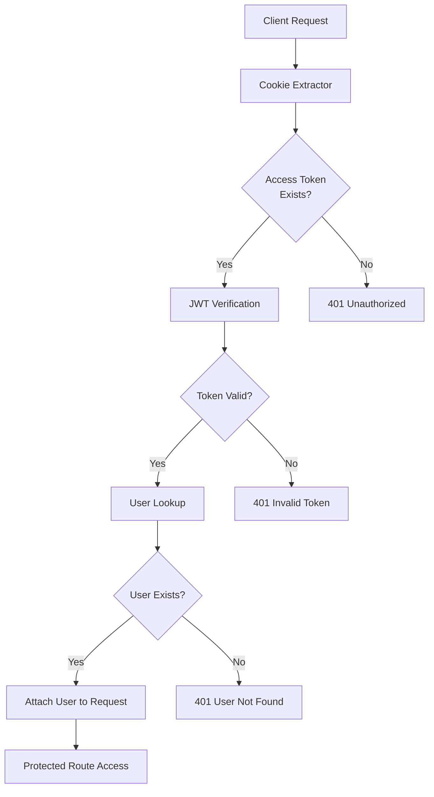
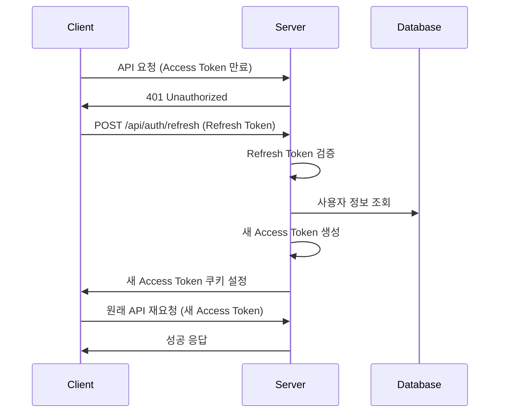
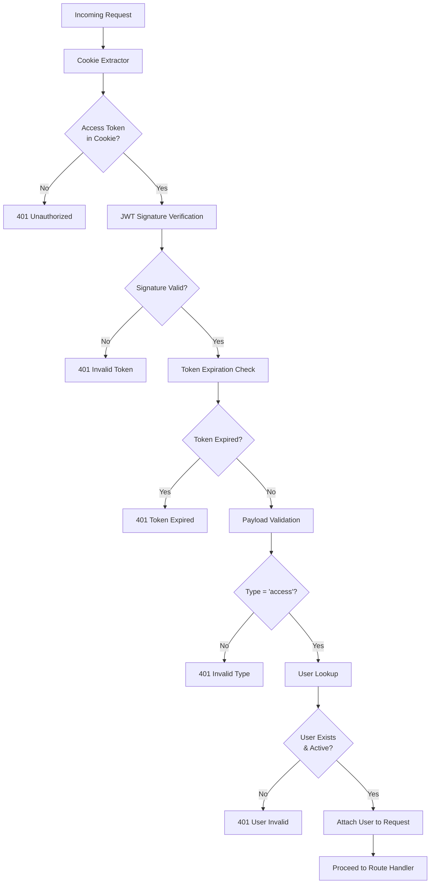

# JWT Authentication Pipeline

TULOG의 JWT 기반 인증 시스템의 상세한 구조와 동작 원리를 설명합니다.

## 📋 Overview

JWT(JSON Web Token) 인증 시스템은 사용자 로그인 후 세션 관리를 담당합니다. Access Token과 Refresh Token을 사용한 이중 토큰 전략으로 보안성과 사용성을 모두 확보합니다.

## 🔄 Token Flow Diagram

```
[Login] → [Token Generation] → [API Request] → [Token Validation] → [Access Granted]
   ↓             ↓                 ↓              ↓                    ↓
사용자 인증    Access/Refresh      요청 헤더        JWT Strategy       리소스 접근
완료          토큰 생성           토큰 포함        쿠키에서 추출       허용
```

## 📊 Detailed Architecture

### JWT Strategy Structure



## 🔐 Token Management System

### 1. Token Generation

**Location**: `AuthService.generateTokenPair()`

```typescript
generateTokenPair(user: User): TokenPair {
  // Access Token (15분 수명)
  const accessToken = this.jwtService.sign({
    sub: user.id,           // Subject: User ID
    email: user.email,      // User Email
    type: 'access'          // Token Type
  }, {
    secret: process.env.JWT_SECRET,
    expiresIn: '15m'
  });

  // Refresh Token (7일 수명)
  const refreshToken = this.jwtService.sign({
    sub: user.id,           // Subject: User ID
    type: 'refresh'         // Token Type (email 제외)
  }, {
    secret: process.env.JWT_REFRESH_SECRET,
    expiresIn: '7d'
  });

  return { accessToken, refreshToken };
}
```

**Token Payload Structure:**

```json
// Access Token
{
  "sub": 123,                    // User ID
  "email": "user@example.com",   // User Email
  "type": "access",              // Token Type
  "iat": 1691234567,            // Issued At
  "exp": 1691235467             // Expires At (15분 후)
}

// Refresh Token
{
  "sub": 123,                    // User ID
  "type": "refresh",             // Token Type
  "iat": 1691234567,            // Issued At
  "exp": 1691839367             // Expires At (7일 후)
}
```

### 2. Cookie Configuration

**Location**: `AuthService.setAuthCookies()`

```typescript
setAuthCookies(res: Response, tokens: TokenPair): void {
  const { accessToken, refreshToken } = tokens;

  // Access Token 쿠키 설정
  res.cookie('accessToken', accessToken, {
    httpOnly: true,                           // XSS 방지
    secure: process.env.NODE_ENV === 'production', // HTTPS 전용
    sameSite: 'strict',                      // CSRF 방지
    maxAge: 15 * 60 * 1000                   // 15분
  });

  // Refresh Token 쿠키 설정
  res.cookie('refreshToken', refreshToken, {
    httpOnly: true,                           // XSS 방지
    secure: process.env.NODE_ENV === 'production', // HTTPS 전용
    sameSite: 'strict',                      // CSRF 방지
    maxAge: 7 * 24 * 60 * 60 * 1000         // 7일
  });
}
```

**Cookie Security Features:**

-   **httpOnly**: JavaScript 접근 차단 (XSS 방지)
-   **secure**: HTTPS에서만 전송 (프로덕션)
-   **sameSite**: CSRF 공격 방지
-   **maxAge**: 토큰별 다른 만료 시간

---

## 🛡️ JWT Authentication Strategy

### Strategy Implementation

**Location**: `jwt.strategy.ts`

```typescript
@Injectable()
export class JwtAuthStrategy extends PassportStrategy(JwtStrategy) {
    constructor(private readonly configService: ConfigService, private readonly userService: UserService) {
        super({
            jwtFromRequest: cookieExtractor, // 쿠키에서 토큰 추출
            ignoreExpiration: false, // 만료 토큰 거부
            secretOrKey: configService.get<string>("JWT_SECRET"),
        });
    }

    async validate(payload: JwtPayload) {
        // 1. Token Type 검증 (Access Token만 허용)
        if (payload.type !== "access") {
            throw new UnauthorizedException("Invalid token type");
        }

        // 2. 사용자 존재 여부 확인
        const user = await this.userService.findUserBySub(payload.sub);
        if (!user) {
            throw new UnauthorizedException("User not found");
        }

        // 3. 사용자 객체를 Request에 첨부
        return user;
    }
}
```

### Cookie Extractor Function

```typescript
const cookieExtractor = (req: Request): string | null => {
    let token = null;
    if (req && req.cookies) {
        token = req.cookies["accessToken"]; // 쿠키에서 accessToken 추출
    }
    return token;
};
```

---

## 🔄 Token Refresh Mechanism

### Refresh Token Flow



### Refresh Implementation

**Endpoint**: `POST /api/auth/refresh`

```typescript
async refreshAccessToken(refreshToken: string): Promise<{
  success: boolean;
  accessToken?: string;
  user?: User;
  message?: string;
}> {
  try {
    // 1. Refresh Token 검증
    const decodedToken: unknown = this.jwtService.verify(refreshToken, {
      secret: process.env.JWT_REFRESH_SECRET
    });

    // 2. Token 구조 검증
    if (!isValidJwtPayload(decodedToken) || decodedToken.type !== 'refresh') {
      return { success: false, message: 'Invalid refresh token.' };
    }

    // 3. 사용자 정보 조회
    const user = await this.userService.findUserById(decodedToken.sub);
    if (!user) {
      return { success: false, message: 'User not found.' };
    }

    // 4. 새 Access Token 생성
    const newAccessToken = this.generateAccessToken(user);

    return {
      success: true,
      accessToken: newAccessToken,
      user
    };
  } catch {
    return { success: false, message: 'Invalid refresh token.' };
  }
}
```

### Automatic Token Refresh (Client-side)

```javascript
// 프론트엔드에서 자동 토큰 갱신 예시
const apiRequest = async (url, options) => {
    try {
        const response = await fetch(url, options);

        if (response.status === 401) {
            // Access Token 만료 시 자동 갱신
            const refreshResponse = await fetch("/api/auth/refresh", {
                method: "POST",
                credentials: "include", // 쿠키 포함
            });

            if (refreshResponse.ok) {
                // 새 토큰으로 원래 요청 재시도
                return await fetch(url, options);
            } else {
                // Refresh 실패 시 로그인 페이지로 리디렉트
                window.location.href = "/login";
            }
        }

        return response;
    } catch (error) {
        console.error("API request failed:", error);
        throw error;
    }
};
```

---

## 🚪 Guards and Decorators

### 1. JwtAuthGuard

**Location**: `jwt-auth.guard.ts`

```typescript
@Injectable()
export class JwtAuthGuard extends AuthGuard("jwt") {
    canActivate(context: ExecutionContext) {
        // JWT Strategy 실행
        return super.canActivate(context);
    }

    handleRequest(err: any, user: any, info: any) {
        if (err || !user) {
            throw err || new UnauthorizedException("Authentication required");
        }
        return user;
    }
}
```

**사용법:**

```typescript
@Get('me')
@UseGuards(JwtAuthGuard)  // JWT 인증 필수
getCurrentUser(@Request() req: { user: User }): User {
  return req.user;  // Strategy에서 검증된 사용자 정보
}
```

### 2. SmartAuthGuard

**Location**: `smart-auth.guard.ts`

```typescript
@Injectable()
export class SmartAuthGuard extends JwtAuthGuard {
    handleRequest(err: any, user: any, info: any, context: ExecutionContext) {
        // 기본 JWT 검증
        const authenticatedUser = super.handleRequest(err, user, info, context);

        // 추가 검증: 활성 사용자만 허용
        if (!authenticatedUser.isActive) {
            throw new ForbiddenException("이메일 인증이 필요합니다. 마이페이지에서 이메일 인증을 완료해주세요.");
        }

        return authenticatedUser;
    }
}
```

**사용법:**

```typescript
@Patch('me')
@UseGuards(SmartAuthGuard)  // JWT + 활성 사용자 검증
async updateUser(@Request() req: { user: User }, @Body() dto: UpdateUserDto) {
  // 활성 사용자만 접근 가능
  return this.userService.updateUser(req.user.id, dto);
}
```

### 3. AdminGuard

**Location**: `only-admin.guard.ts`

```typescript
@Injectable()
export class AdminGuard extends JwtAuthGuard {
    handleRequest(err: any, user: any, info: any, context: ExecutionContext) {
        // 기본 JWT 검증
        const authenticatedUser = super.handleRequest(err, user, info, context);

        // 관리자 권한 검증
        if (authenticatedUser.role !== "admin") {
            throw new ForbiddenException("Admin access required");
        }

        return authenticatedUser;
    }
}
```

---

## 🔍 Token Validation Process

### Validation Pipeline



### Type Guard Function

```typescript
function isValidJwtPayload(token: unknown): token is JwtPayload {
    if (typeof token !== "object" || token === null) {
        return false;
    }

    const obj = token as Record<string, unknown>;

    return (
        "sub" in obj && // User ID 존재
        "type" in obj && // Token Type 존재
        typeof obj.sub === "number" && // User ID는 숫자
        (obj.type === "access" || obj.type === "refresh") // 유효한 타입
    );
}
```

---

## 🚪 Route Protection Patterns

### 1. Public Routes (인증 불필요)

```typescript
@Get('health')
getHealth() {
  return { status: 'OK' };
}

@Get(':id')
getUserById(@Param('id') id: number) {
  // 누구나 접근 가능
  return this.userService.getUserById(id);
}
```

### 2. Authenticated Routes (JWT 필요)

```typescript
@Get('me')
@UseGuards(JwtAuthGuard)
getCurrentUser(@Request() req: { user: User }) {
  // JWT 토큰 필수
  return req.user;
}
```

### 3. Active User Routes (활성 사용자만)

```typescript
@Patch('me')
@UseGuards(SmartAuthGuard)
updateUser(@Request() req: { user: User }, @Body() dto: UpdateUserDto) {
  // JWT + 이메일 인증 완료 사용자만
  return this.userService.updateUser(req.user.id, dto);
}
```

### 4. Admin Routes (관리자만)

```typescript
@Get('all')
@UseGuards(AdminGuard)
getAllUsers() {
  // 관리자 권한 필수
  return this.userService.findAllUsers();
}
```

---

## 🔒 Security Features

### 1. **Token Security**

-   **Short-lived Access Token**: 15분 수명으로 탈취 위험 최소화
-   **Long-lived Refresh Token**: 7일 수명으로 사용성 확보
-   **Separate Secrets**: Access/Refresh 토큰 각각 다른 시크릿 키 사용

### 2. **Cookie Security**

-   **HttpOnly**: JavaScript 접근 차단으로 XSS 방지
-   **Secure**: HTTPS에서만 전송 (프로덕션)
-   **SameSite=Strict**: CSRF 공격 방지

### 3. **Token Type Validation**

-   **Type Field**: 토큰 타입을 페이로드에 포함
-   **Type Checking**: Access Token만 API 접근 허용
-   **Refresh Token**: 오직 토큰 갱신에만 사용

### 4. **User State Validation**

-   **Existence Check**: 토큰 검증 시 사용자 존재 여부 확인
-   **Active Status**: 활성 사용자만 특정 기능 접근 허용
-   **Role-based Access**: 역할별 접근 제어

---

## 🚨 Error Handling

### JWT 관련 에러

```typescript
// 1. 토큰 없음
throw new UnauthorizedException("Authentication required");

// 2. 잘못된 토큰
throw new UnauthorizedException("Invalid token");

// 3. 만료된 토큰
throw new UnauthorizedException("Token expired");

// 4. 잘못된 토큰 타입
throw new UnauthorizedException("Invalid token type");

// 5. 사용자 없음
throw new UnauthorizedException("User not found");

// 6. 비활성 사용자
throw new ForbiddenException("이메일 인증이 필요합니다.");

// 7. 권한 없음
throw new ForbiddenException("Admin access required");
```

### Client-side Error Handling

```javascript
// API 응답 에러 처리
const handleApiError = (error) => {
    if (error.status === 401) {
        // 인증 에러: 로그인 페이지로 이동
        localStorage.clear();
        window.location.href = "/login";
    } else if (error.status === 403) {
        // 권한 에러: 적절한 메시지 표시
        showErrorMessage("접근 권한이 없습니다.");
    } else {
        // 기타 에러
        showErrorMessage("요청 처리 중 오류가 발생했습니다.");
    }
};
```

---

## 🔧 Configuration

### Environment Variables

```env
# JWT Secrets (강력한 랜덤 문자열 사용)
JWT_SECRET=your_super_secret_jwt_key_256_bits_minimum
JWT_REFRESH_SECRET=your_super_secret_refresh_key_256_bits_minimum

# Token Expiration
JWT_ACCESS_EXPIRES_IN=15m
JWT_REFRESH_EXPIRES_IN=7d

# Cookie Settings
COOKIE_SECURE=true              # 프로덕션에서 true
COOKIE_SAME_SITE=strict

# Environment
NODE_ENV=production
```

### JWT Module Configuration

```typescript
// app.module.ts
JwtModule.register({
  secret: process.env.JWT_SECRET,
  signOptions: {
    expiresIn: process.env.JWT_ACCESS_EXPIRES_IN || '15m',
  },
}),
```

---

## 📊 Performance Considerations

### 1. **Database Queries**

-   **User Lookup Optimization**: 사용자 조회 시 필요한 필드만 선택
-   **Caching Strategy**: 사용자 정보 캐싱 고려 (Redis)
-   **Index Optimization**: user.id 인덱스 활용

### 2. **Token Validation**

-   **In-Memory Validation**: JWT는 상태가 없어 DB 조회 불필요
-   **Short Circuit**: 토큰 타입 검증을 우선 수행
-   **User Cache**: 자주 조회되는 사용자 정보 캐싱

### 3. **Cookie Handling**

-   **Minimal Cookie Size**: 토큰만 쿠키에 저장
-   **Compression**: 큰 페이로드의 경우 압축 고려
-   **Domain Optimization**: 서브도메인 쿠키 공유 최적화

---

## 📝 TODO & Future Improvements

### 1. **Token Blacklist**

```typescript
// 로그아웃 시 토큰 무효화
interface TokenBlacklist {
    tokenId: string;
    expiresAt: Date;
}

// Redis 기반 토큰 블랙리스트
const blacklistToken = async (tokenId: string, expiresAt: Date) => {
    await redis.setex(`blacklist:${tokenId}`, expiresAt.getTime(), "true");
};
```

### 2. **Refresh Token Rotation**

```typescript
// 보안 강화를 위한 토큰 순환
const rotateRefreshToken = (oldRefreshToken: string) => {
    // 기존 토큰 무효화
    blacklistToken(oldRefreshToken);

    // 새 토큰 쌍 생성
    return generateTokenPair(user);
};
```

### 3. **Multi-device Session Management**

```typescript
// 디바이스별 세션 관리
interface UserSession {
    userId: number;
    deviceId: string;
    refreshTokenId: string;
    lastActive: Date;
    deviceInfo: string;
}
```

### 4. **Advanced Security Features**

-   **Geolocation Validation**: 비정상적인 위치에서의 로그인 감지
-   **Device Fingerprinting**: 디바이스 고유 식별
-   **Concurrent Session Limits**: 동시 로그인 세션 제한
-   **Anomaly Detection**: 비정상적인 접근 패턴 감지

### 5. **Monitoring & Analytics**

-   **Token Usage Metrics**: 토큰 사용 통계
-   **Authentication Logs**: 인증 관련 로그 수집
-   **Performance Monitoring**: JWT 검증 성능 모니터링
-   **Security Alerts**: 보안 이벤트 알림
