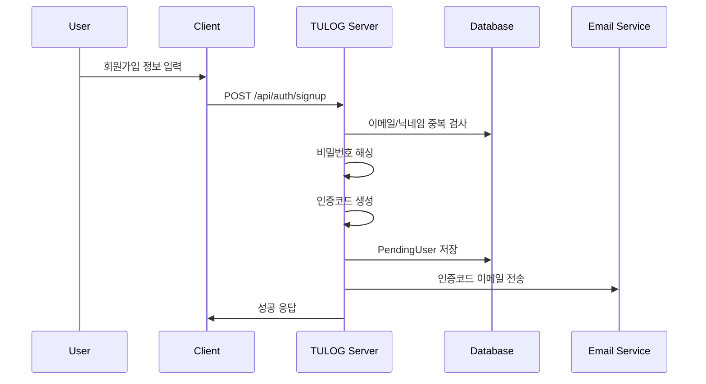
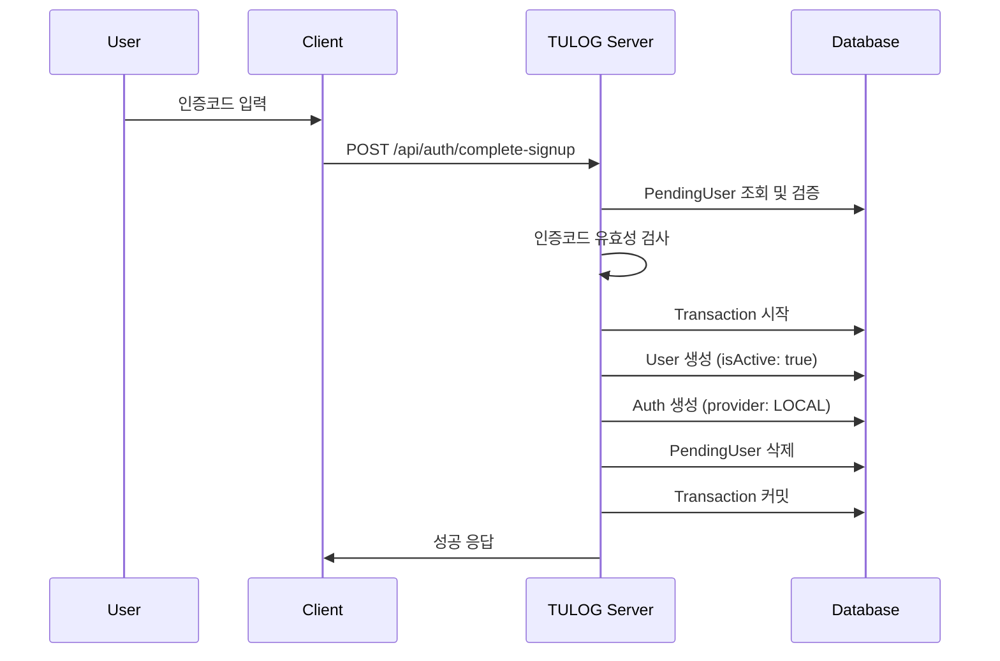
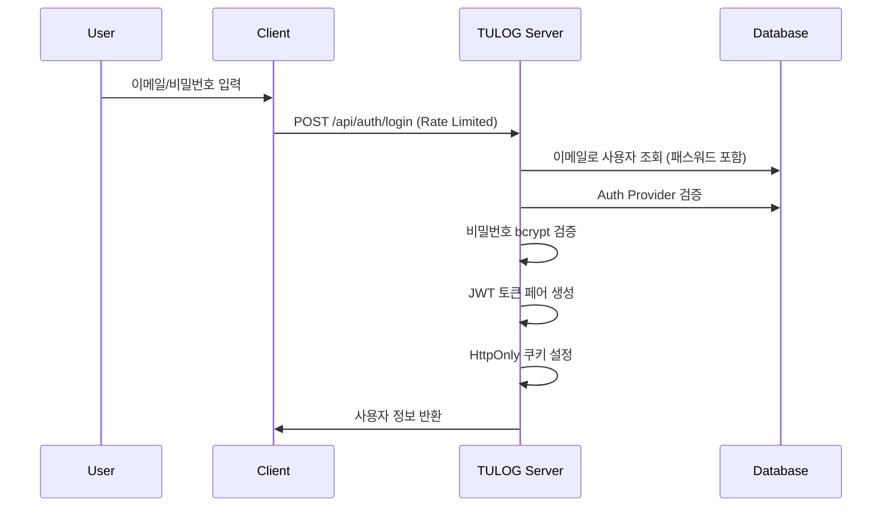
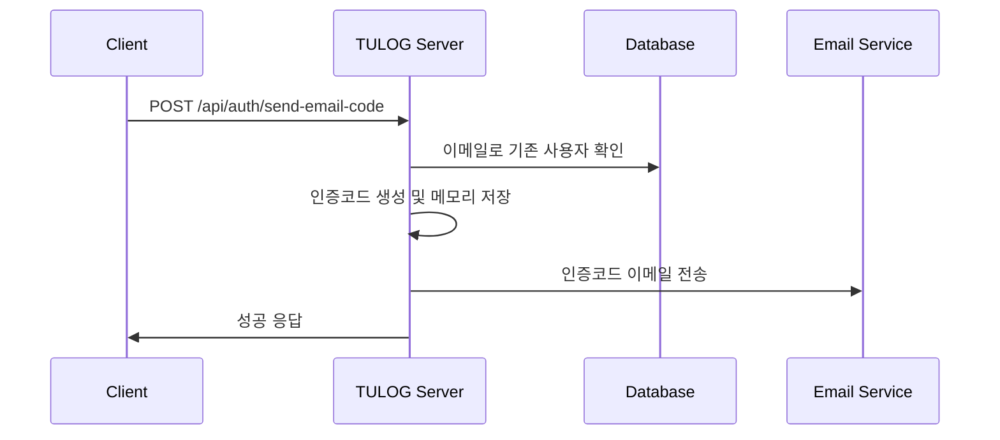
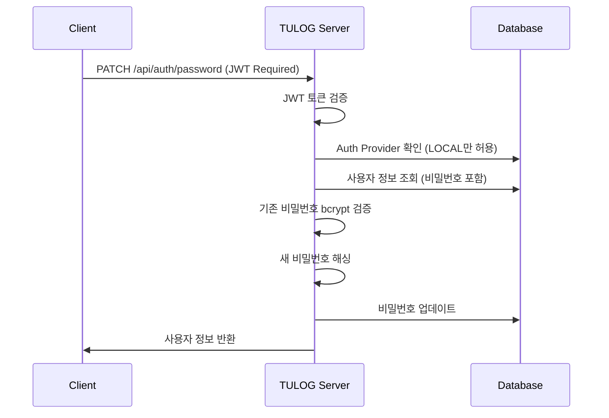

# Local Login Pipeline

로컬 계정을 통한 회원가입과 로그인 프로세스의 상세한 비즈니스 로직을 설명합니다.

## 📋 Overview

로컬 로그인 시스템은 이메일과 비밀번호를 사용하는 전통적인 인증 방식입니다. 이메일 인증을 통한 회원가입과 비밀번호 기반 로그인을 제공합니다.

## 🔄 Flow Diagram

```
[회원가입] → [이메일 인증] → [계정 활성화] → [로그인] → [토큰 발급]
    ↓           ↓            ↓           ↓         ↓
  사용자        인증코드      계정생성     인증      세션관리
  정보입력      전송/확인     완료        성공      시작
```

## 📊 Detailed Pipeline

## Part 1: 회원가입 프로세스

### Phase 1: 초기 회원가입 요청

**Endpoint**: `POST /api/auth/signup`



**처리 과정:**

#### 1-1. 요청 데이터 검증

```typescript
// CreateLocalUserDto 검증
{
  email: "user@example.com",        // 이메일 형식 검증
  password: "Example1@",            // 패스워드 정책 검증
  passwordConfirm: "Example1@",     // 패스워드 일치 검증
  name: "홍길동",                   // 이름 필수
  nickname: "hong123"               // 닉네임 유니크 검증
}
```

#### 1-2. 중복 검사

```typescript
// AuthService.signup()
// 1. 이메일 중복 검사 (비활성 계정 포함)
const existingUser = await this.userService.findUserIncludingNoActiveByEmail(dto.email);
if (existingUser) {
    throw new ConflictException("Email already exists.");
}

// 2. 닉네임 중복 검사 (비활성 계정 포함)
const existingUserNickname = await this.userService.findUserIncludingNoActiveByNickname(dto.nickname);
if (existingUserNickname) {
    throw new ConflictException("Nickname already exists.");
}

// 3. 기존 대기 중인 가입 정보 삭제
const existingPending = await this.pendingUserRepository.findByEmail(dto.email);
if (existingPending) {
    await this.pendingUserRepository.remove(existingPending);
}
```

#### 1-3. 비밀번호 해싱 및 인증코드 생성

```typescript
// 비밀번호 해싱 (bcrypt, salt rounds: 10)
const hashedPassword = await bcrypt.hash(dto.password, 10);

// 6자리 인증코드 생성
const verificationCode = Math.floor(100000 + Math.random() * 900000).toString();

// 만료 시간 설정 (10분)
const codeExpiresAt = new Date(Date.now() + 10 * 60 * 1000);
```

#### 1-4. PendingUser 저장

```typescript
// pending_user 테이블에 임시 저장
await this.pendingUserRepository.create({
    email: dto.email,
    password: hashedPassword, // 해싱된 비밀번호
    name: dto.name,
    nickname: dto.nickname,
    verificationCode, // 6자리 숫자
    codeExpiresAt, // 10분 후 만료
});
```

#### 1-5. 인증 이메일 발송

```typescript
// Gmail SMTP를 통한 이메일 발송
const transporter = nodemailer.createTransporter({
    service: "gmail",
    auth: {
        user: process.env.GMAIL_OAUTH_USER,
        pass: process.env.EMAIL_PASS,
    },
});

const mailOptions = {
    from: process.env.GMAIL_OAUTH_USER,
    to: email,
    subject: "Tulog 회원가입 인증코드",
    html: `
    <div style="font-family: Arial, sans-serif; max-width: 600px;">
      <h2>TULOG 회원가입 인증</h2>
      <p>아래 인증코드를 입력하여 회원가입을 완료해주세요:</p>
      <div style="background-color: #f4f4f4; padding: 20px; text-align: center;">
        <h3 style="color: #333; font-size: 24px;">${code}</h3>
      </div>
      <p>인증코드는 10분간 유효합니다.</p>
    </div>
  `,
};
```

---

### Phase 2: 이메일 인증 완료

**Endpoint**: `POST /api/auth/complete-signup`



**처리 과정:**

#### 2-1. 인증코드 검증

```typescript
// AuthService.completeSignup()
const pendingUser = await this.pendingUserRepository.findByEmailAndCode(email, code);

if (!pendingUser) {
    throw new BadRequestException("Invalid verification code or email address.");
}

// 만료 시간 검사
if (pendingUser.codeExpiresAt < new Date()) {
    await this.pendingUserRepository.remove(pendingUser);
    throw new BadRequestException("Verification code has expired. Please register again.");
}
```

#### 2-2. 중복 재검사

```typescript
// 가입 과정 중 동일 이메일로 다른 가입이 완료되었는지 확인
const existingUser = await this.userService.findUserIncludingNoActiveByEmail(email);
if (existingUser) {
    await this.pendingUserRepository.remove(pendingUser);
    throw new ConflictException("Email already exists.");
}
```

#### 2-3. 사용자 계정 생성 (트랜잭션)

```typescript
const queryRunner = this.dataSource.createQueryRunner();
await queryRunner.connect();
await queryRunner.startTransaction();

try {
    // 1. User 엔티티 생성 (즉시 활성화)
    const createdUser = await queryRunner.manager.save(User, {
        email: pendingUser.email,
        password: pendingUser.password, // 이미 해싱된 비밀번호
        name: pendingUser.name,
        nickname: pendingUser.nickname,
        profilePicture: this.configService.get("USER_DEFAULT_AVATAR_URL"),
        isActive: true, // 즉시 활성화
    });

    // 2. Auth 엔티티 생성
    await queryRunner.manager.save(Auth, {
        provider: AuthProvider.LOCAL,
        user: createdUser,
        // oauthId는 LOCAL 계정의 경우 null
    });

    // 3. PendingUser 삭제
    await this.pendingUserRepository.remove(pendingUser);

    // 4. 트랜잭션 커밋
    await queryRunner.commitTransaction();

    return {
        email: createdUser.email,
        message: "Account created successfully!",
    };
} catch (error) {
    // 실패 시 롤백
    await queryRunner.rollbackTransaction();
    throw new InternalServerErrorException("Failed to complete registration");
} finally {
    await queryRunner.release();
}
```

---

## Part 2: 로그인 프로세스

### Phase 3: 로컬 계정 로그인

**Endpoint**: `POST /api/auth/login`



**처리 과정:**

#### 3-1. Rate Limiting

```typescript
// @UseGuards(RateLimitGuard) 적용
// 무차별 대입 공격 방지
```

#### 3-2. 사용자 인증

```typescript
// AuthService.login()
// 1. 이메일로 사용자 조회 (비밀번호 포함)
const user = await this.userService.findUserWithPasswordByEmail(loginDto.email);
if (!user) {
    throw new BadRequestException("User not found.");
}

// 2. Auth Provider 검증
const auth = await this.getAuthByUserId(user.id);
if (auth.provider !== AuthProvider.LOCAL) {
    throw new BadRequestException("Login is only allowed for local accounts.");
}

// 3. 비밀번호 검증
const isPasswordValid = await bcrypt.compare(loginDto.password, user.password);
if (!isPasswordValid) {
    throw new BadRequestException("Invalid password.");
}
```

#### 3-3. JWT 토큰 생성 및 쿠키 설정

```typescript
// 토큰 페어 생성
const tokens = this.generateTokenPair(user);

// Access Token (15분)
const accessToken = this.jwtService.sign(
    {
        sub: user.id,
        email: user.email,
        type: "access",
    },
    {
        secret: process.env.JWT_SECRET,
        expiresIn: "15m",
    }
);

// Refresh Token (7일)
const refreshToken = this.jwtService.sign(
    {
        sub: user.id,
        type: "refresh",
    },
    {
        secret: process.env.JWT_REFRESH_SECRET,
        expiresIn: "7d",
    }
);

// HttpOnly 쿠키 설정
this.setAuthCookies(res, tokens);

// 사용자 정보 반환 (비밀번호 제외)
return await this.userService.getUserByEmail(user.email);
```

---

## Part 3: 추가 기능

### Phase 4: 이메일 인증코드 전송 (기존 사용자용)

**Endpoint**: `POST /api/auth/send-email-code`



**처리 과정:**

```typescript
// AuthService.sendEmailCode()
// 1. 6자리 코드 생성
const code = this.generateCode();

// 2. 메모리에 임시 저장 (Map)
this.emailCodeStore.set(email, code);

// 3. 이메일 발송
await transporter.sendMail({
    from: process.env.GMAIL_OAUTH_USER,
    to: email,
    subject: "Tulog 인증코드",
    text: `인증코드: ${code}`,
});
```

### Phase 5: 이메일 인증코드 확인

**Endpoint**: `POST /api/auth/check-code`

**처리 과정:**

```typescript
// AuthService.verifyEmailCode()
// 1. 저장된 코드 확인
const storedCode = this.emailCodeStore.get(email);
if (!storedCode || storedCode !== code) {
    throw new BadRequestException("Verification code does not match.");
}

// 2. 사용자 계정 활성화
await this.userService.activateUser(user.id);

// 3. 코드 삭제
this.emailCodeStore.delete(email);
```

### Phase 6: 비밀번호 변경

**Endpoint**: `PATCH /api/auth/password`



**처리 과정:**

```typescript
// AuthService.updatePassword()
// 1. Provider 검증 (LOCAL 계정만)
const auth = await this.getAuthByUserId(user.id);
if (auth.provider !== AuthProvider.LOCAL) {
    throw new BadRequestException("Password update is only allowed for local accounts.");
}

// 2. 기존 비밀번호 확인
const userWithPW = await this.userService.findUserWithPasswordByEmail(user.email);
const isPasswordValid = await bcrypt.compare(updatePasswordDto.oldPassword, userWithPW.password);
if (!isPasswordValid) {
    throw new BadRequestException("Old password is incorrect.");
}

// 3. 새 비밀번호 해싱 및 업데이트
const hashedNewPassword = await bcrypt.hash(updatePasswordDto.newPassword, 10);
await this.userService.updatePassword(user.id, hashedNewPassword);
```

---

## 🔒 Security Measures

### 1. **Password Security**

-   **bcrypt 해싱**: Salt rounds 10
-   **Password Policy**: 최소 8자, 대소문자, 숫자, 특수문자 포함
-   **Password Confirmation**: 회원가입 시 비밀번호 재확인

### 2. **Email Verification**

-   **Two-Step Process**: 회원가입 → 이메일 인증 → 계정 활성화
-   **Code Expiration**: 인증코드 10분 후 자동 만료
-   **Unique Codes**: 6자리 랜덤 숫자 코드

### 3. **Rate Limiting**

-   **Login Attempts**: 로그인 시도 제한
-   **Brute Force Protection**: 무차별 대입 공격 방지

### 4. **Data Validation**

-   **DTO Validation**: class-validator를 통한 입력 검증
-   **Duplicate Prevention**: 이메일/닉네임 중복 방지
-   **SQL Injection Prevention**: TypeORM 쿼리 빌더 사용

### 5. **Token Management**

-   **JWT Strategy**: Access/Refresh 토큰 분리
-   **HttpOnly Cookies**: XSS 공격 방지
-   **Secure Transport**: HTTPS 환경에서 Secure 플래그

---

## 📊 Database Schema

### PendingUser Table (임시 가입 정보)

```sql
CREATE TABLE pending_user (
  id INT PRIMARY KEY AUTO_INCREMENT,
  email VARCHAR(255) UNIQUE NOT NULL,
  password VARCHAR(255) NOT NULL,      -- bcrypt 해시
  name VARCHAR(100) NOT NULL,
  nickname VARCHAR(50) UNIQUE NOT NULL,
  verificationCode VARCHAR(6) NOT NULL, -- 6자리 숫자
  codeExpiresAt DATETIME NOT NULL,      -- 10분 후 만료
  createdAt TIMESTAMP DEFAULT CURRENT_TIMESTAMP
);
```

### User Table (로컬 사용자)

```sql
-- 로컬 계정으로 생성된 사용자
INSERT INTO user (
  email,
  password,     -- bcrypt 해시된 비밀번호
  name,
  nickname,
  profilePicture,
  isActive      -- true (이메일 인증 완료 후)
) VALUES (
  'user@example.com',
  '$2b$10$hash...',
  'John Doe',
  'john123',
  'https://github.com/DOforTU/tulog/blob/main/img/user-profile/default-avatar.png?raw=true',
  true
);
```

### Auth Table (로컬 인증)

```sql
INSERT INTO auth (
  provider,     -- 'local'
  oauthId,      -- NULL (로컬 계정)
  userId
) VALUES (
  'local',
  NULL,
  1
);
```

---

## ⚠️ Error Handling

### 1. **회원가입 오류**

```typescript
// 이메일 중복
throw new ConflictException("Email already exists.");

// 닉네임 중복
throw new ConflictException("Nickname already exists.");

// 인증코드 만료
throw new BadRequestException("Verification code has expired. Please register again.");
```

### 2. **로그인 오류**

```typescript
// 사용자 없음
throw new BadRequestException("User not found.");

// 잘못된 비밀번호
throw new BadRequestException("Invalid password.");

// 다른 Provider 계정
throw new BadRequestException("Login is only allowed for local accounts.");
```

### 3. **비밀번호 변경 오류**

```typescript
// OAuth 계정
throw new BadRequestException("Password update is only allowed for local accounts.");

// 기존 비밀번호 불일치
throw new BadRequestException("Old password is incorrect.");
```

---

## 📧 Email Templates

### 회원가입 인증 이메일

```html
<div style="font-family: Arial, sans-serif; max-width: 600px; margin: 0 auto;">
    <h2>TULOG 회원가입 인증</h2>
    <p>안녕하세요! TULOG에 가입해주셔서 감사합니다.</p>
    <p>아래 인증코드를 입력하여 회원가입을 완료해주세요:</p>
    <div style="background-color: #f4f4f4; padding: 20px; text-align: center; margin: 20px 0;">
        <h3 style="color: #333; font-size: 24px; margin: 0;">123456</h3>
    </div>
    <p>인증코드는 10분간 유효합니다.</p>
    <p>감사합니다.<br />TULOG 팀</p>
</div>
```

---

## 🔧 Configuration

### Environment Variables

```env
# JWT 설정
JWT_SECRET=your_jwt_secret_key
JWT_REFRESH_SECRET=your_refresh_secret_key

# Email 설정
GMAIL_OAUTH_USER=your_gmail@gmail.com
EMAIL_PASS=your_app_password

# Default 설정
USER_DEFAULT_AVATAR_URL=https://github.com/DOforTU/tulog/blob/main/img/user-profile/default-avatar.png?raw=true

# 환경
NODE_ENV=development
```

### Password Policy (DTO Validation)

```typescript
// CreateLocalUserDto
@IsStrongPassword({
  minLength: 8,
  minLowercase: 1,
  minUppercase: 1,
  minNumbers: 1,
  minSymbols: 1
}, {
  message: 'Password must contain at least 8 characters, including uppercase, lowercase, number and special character'
})
password: string;
```

---

## 🚀 Performance Considerations

### 1. **Database Optimization**

-   **Indexes**: email, nickname 필드에 인덱스 적용
-   **Connection Pooling**: TypeORM 연결 풀 관리
-   **Transaction Scope**: 최소 범위로 트랜잭션 적용

### 2. **Memory Management**

-   **Temporary Storage**: 인증코드를 메모리에 임시 저장
-   **Cleanup**: 만료된 코드 자동 정리 (향후 Redis 도입 고려)

### 3. **Email Service**

-   **Async Processing**: 이메일 발송을 비동기 처리
-   **Retry Mechanism**: 실패 시 재시도 로직
-   **Rate Limiting**: 이메일 발송 제한

---

## 📝 TODO & Future Improvements

1. **Redis Integration**: 인증코드 저장을 Redis로 이전
2. **Email Queue**: 이메일 발송을 큐 시스템으로 처리
3. **Password History**: 이전 비밀번호 재사용 방지
4. **Account Lockout**: 로그인 실패 시 계정 잠금
5. **Two-Factor Authentication**: 2FA 도입
6. **Password Reset**: 비밀번호 찾기 기능
7. **Email Templates**: 더 나은 이메일 디자인
8. **Audit Logging**: 인증 관련 로그 강화
