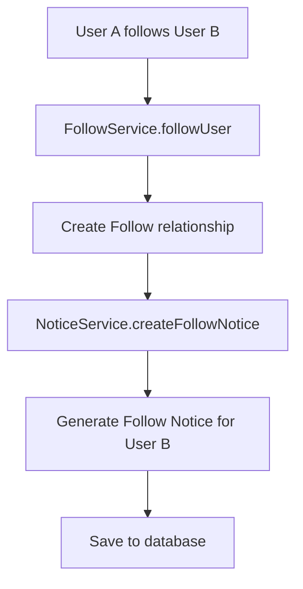
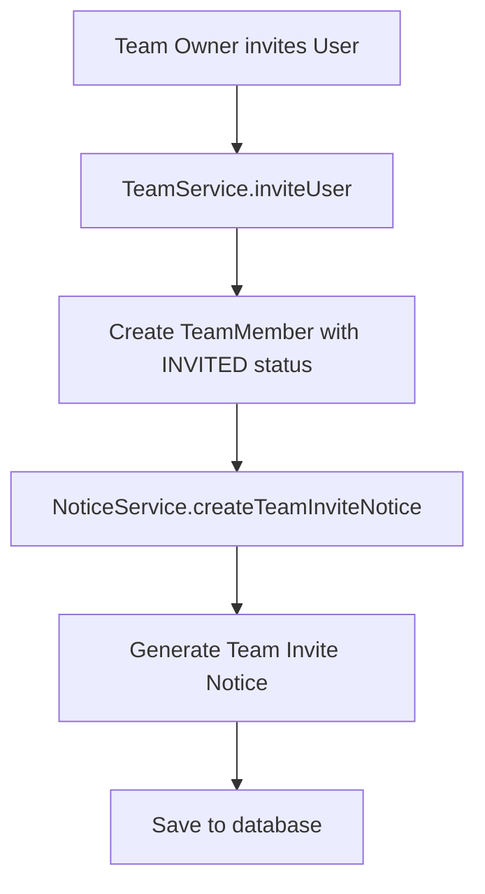
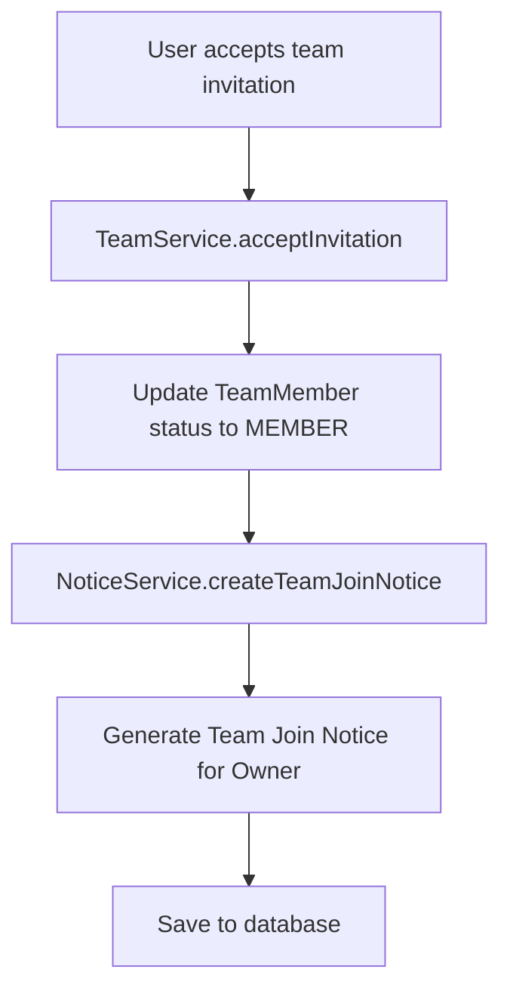
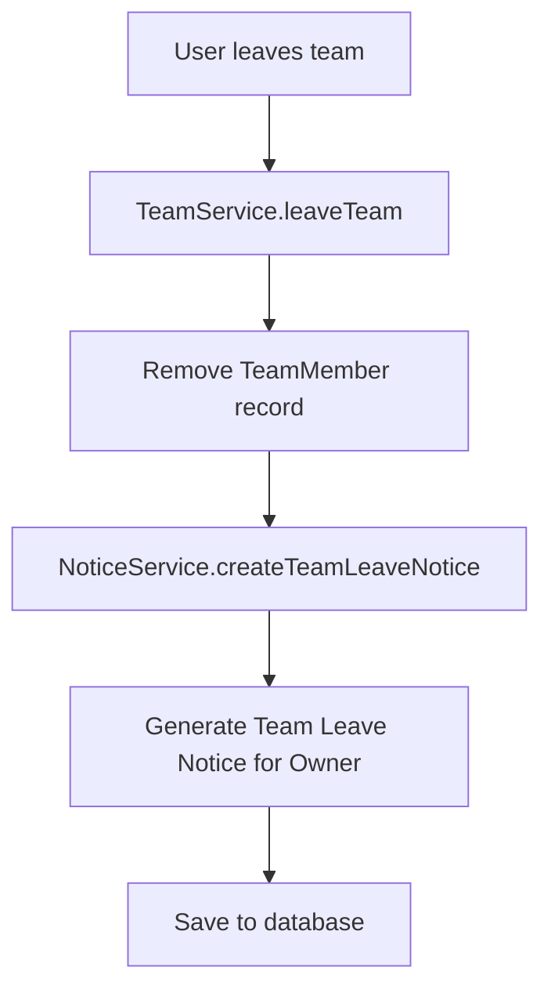
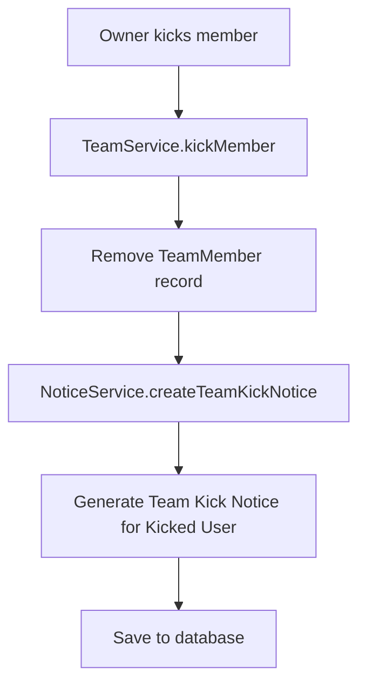
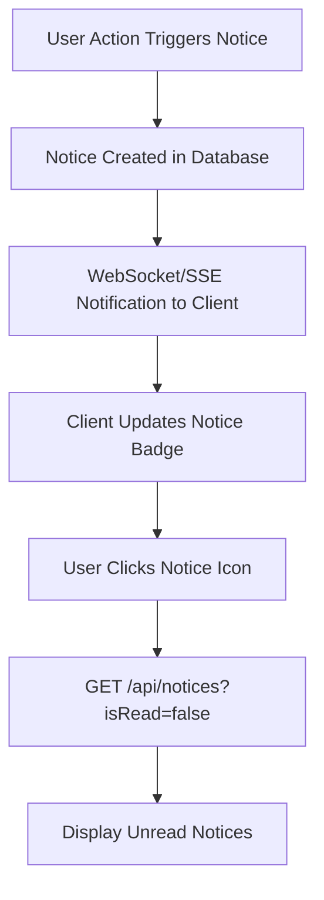
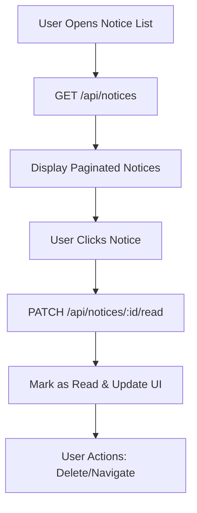

# Notice System Pipeline

알림 시스템의 전체적인 흐름과 비즈니스 로직을 설명합니다.

## 🔔 시스템 개요

Notice 시스템은 사용자에게 다양한 이벤트에 대한 알림을 제공하는 시스템입니다.

### 주요 특징

-   **실시간 알림**: 사용자 액션에 따른 즉시 알림 생성
-   **타입별 분류**: 6가지 알림 타입으로 체계적 관리
-   **효율적인 조회**: 인덱싱과 페이징을 통한 빠른 조회
-   **자동 정리**: 오래된 알림 자동 삭제

## 📊 Notice Types & Triggers

```
FOLLOW        → 다른 사용자가 나를 팔로우할 때
TEAM_INVITE   → 팀에 초대받았을 때
TEAM_JOIN     → 새로운 멤버가 내 팀에 가입했을 때
TEAM_LEAVE    → 팀원이 내 팀을 탈퇴했을 때
TEAM_KICK     → 팀에서 추방당했을 때
SYSTEM        → 시스템 공지사항
```

## 🔄 Notice Creation Flow

### 1. Follow Notice Creation



#### Implementation

```typescript
// follow.service.ts
async followUser(followerId: number, targetUserId: number) {
  return await this.dataSource.transaction(async (manager) => {
    // 1. Create follow relationship
    const follow = await this.followRepository.createFollowWithTransaction(
      { followerId, targetUserId },
      manager
    );

    // 2. Get follower info for notice
    const follower = await manager.getRepository(User).findOne({
      where: { id: followerId }
    });

    // 3. Create follow notice
    await this.noticeService.createFollowNotice(
      targetUserId,
      followerId,
      follower.nickname
    );

    return follow;
  });
}
```

### 2. Team Invite Notice Creation



#### Implementation

```typescript
// team.service.ts
async inviteUser(teamId: number, ownerId: number, targetUserId: number) {
  return await this.dataSource.transaction(async (manager) => {
    // 1. Verify ownership and create invite
    const invitation = await this.teamMemberRepository.createInvitationWithTransaction(
      teamId, targetUserId, manager
    );

    // 2. Get team and owner info
    const team = await manager.getRepository(Team).findOne({ where: { id: teamId } });
    const owner = await manager.getRepository(User).findOne({ where: { id: ownerId } });

    // 3. Create team invite notice
    await this.noticeService.createTeamInviteNotice(
      targetUserId,
      teamId,
      team.name,
      owner.nickname
    );

    return invitation;
  });
}
```

### 3. Team Join Notice Creation



### 4. Team Leave Notice Creation



### 5. Team Kick Notice Creation



## 🗄️ Database Schema & Indexes

### Notice Entity

```sql
CREATE TABLE notice (
  id SERIAL PRIMARY KEY,
  user_id INTEGER NOT NULL REFERENCES user(id),
  type VARCHAR(20) NOT NULL CHECK (type IN ('FOLLOW', 'TEAM_INVITE', 'TEAM_JOIN', 'TEAM_LEAVE', 'TEAM_KICK', 'SYSTEM')),
  title VARCHAR(255) NOT NULL,
  content TEXT NOT NULL,
  is_read BOOLEAN DEFAULT FALSE,
  related_entity_type VARCHAR(50),
  related_entity_id INTEGER,
  metadata JSONB,
  created_at TIMESTAMP DEFAULT NOW()
);
```

### Performance Indexes

```sql
-- User-specific queries
CREATE INDEX idx_notice_user_id ON notice(user_id);

-- Unread notices (most common query)
CREATE INDEX idx_notice_user_read ON notice(user_id, is_read);

-- Type-based filtering
CREATE INDEX idx_notice_type ON notice(type);

-- Time-based ordering and cleanup
CREATE INDEX idx_notice_created ON notice(created_at);
```

## 📱 Client Integration Flow

### 1. Real-time Notice Display



### 2. Notice Management Flow



## 🛠️ Service Layer Architecture

### NoticeService Methods

#### Core CRUD Operations

```typescript
// Create individual notice
createNotice(createNoticeDto: CreateNoticeDto): Promise<Notice>

// Get user notices with pagination and filters
getUserNotices(userId: number, queryDto: QueryNoticeDto): Promise<NoticeListResult>

// Mark operations
markAsRead(userId: number, noticeId: number): Promise<Notice>
markAllAsRead(userId: number): Promise<{ updatedCount: number }>

// Delete operations
deleteNotice(userId: number, noticeId: number): Promise<void>
```

#### Specialized Creation Methods

```typescript
// Event-specific notice creation
createFollowNotice(targetUserId: number, followerUserId: number, followerUsername: string): Promise<Notice>
createTeamInviteNotice(userId: number, teamId: number, teamName: string, inviterUsername: string): Promise<Notice>
createTeamJoinNotice(teamOwnerId: number, teamId: number, teamName: string, newMemberUsername: string): Promise<Notice>
createTeamLeaveNotice(teamOwnerId: number, teamId: number, teamName: string, leftMemberUsername: string): Promise<Notice>
createTeamKickNotice(kickedUserId: number, teamId: number, teamName: string, kickerUsername: string): Promise<Notice>
createSystemNotice(userId: number, title: string, content: string, metadata?: Record<string, any>): Promise<Notice>
```

#### Utility Methods

```typescript
// Get unread count for badge display
getUnreadCount(userId: number): Promise<{ count: number }>

// Bulk operations with transaction
createMultipleNotices(createNoticeDtos: CreateNoticeDto[]): Promise<Notice[]>

// Cleanup for scheduled jobs
cleanupOldNotices(daysOld: number): Promise<{ deletedCount: number }>
```

## 🔒 Security & Validation

### Access Control

-   **User Ownership**: 사용자는 자신의 알림만 조회/수정/삭제 가능
-   **JWT Authentication**: 모든 엔드포인트에서 JWT 토큰 검증
-   **Input Validation**: DTO를 통한 입력값 검증

### Data Validation

```typescript
// CreateNoticeDto validation
@IsEnum(NoticeType) type: NoticeType;
@IsString() @MaxLength(255) title: string;
@IsString() content: string;
@IsNumber() userId: number;
@IsOptional() @IsObject() metadata?: Record<string, any>;

// QueryNoticeDto validation
@IsOptional() @IsBoolean() isRead?: boolean;
@IsOptional() @IsEnum(NoticeType) type?: NoticeType;
@IsOptional() @IsNumber() @Min(1) page?: number;
@IsOptional() @IsNumber() @Min(1) @Max(100) limit?: number;
```

## ⚡ Performance Optimizations

### Database Level

-   **Composite Indexes**: (user_id, is_read) 복합 인덱스로 빠른 미읽음 조회
-   **Pagination**: 기본 20개 제한, 최대 100개로 제한
-   **Selective Loading**: 필요한 필드만 조회

### Application Level

-   **Transaction Usage**: 연관 작업들을 트랜잭션으로 묶어 데이터 일관성 보장
-   **Batch Operations**: 여러 알림 생성 시 배치 처리
-   **Eager Loading**: User 관계 미리 로딩으로 N+1 문제 방지

### Cleanup Strategy

```typescript
// Scheduled job for old notice cleanup
@Cron('0 2 * * *') // Daily at 2 AM
async cleanupOldNotices() {
  const result = await this.noticeService.cleanupOldNotices(30); // 30일 이상
  this.logger.log(`Cleaned up ${result.deletedCount} old notices`);
}
```

## 🚀 Future Enhancements

### Real-time Notifications

-   **WebSocket Integration**: 실시간 알림 푸시
-   **Push Notifications**: 모바일 앱 푸시 알림
-   **Email Notifications**: 중요 알림 이메일 발송

### Advanced Features

-   **Notice Templates**: 알림 템플릿 시스템
-   **User Preferences**: 알림 타입별 수신 설정
-   **Notification Channels**: 다양한 알림 채널 지원
-   **Rich Content**: 이미지/링크 포함 알림

### Analytics

-   **Notice Metrics**: 알림 열람률, 클릭률 분석
-   **User Engagement**: 사용자 알림 패턴 분석
-   **A/B Testing**: 알림 내용 최적화

## 🔧 Development Guidelines

### Notice Creation Best Practices

1. **트랜잭션 사용**: 연관 작업과 함께 알림 생성
2. **메타데이터 활용**: 향후 확장을 위한 구조화된 데이터 저장
3. **적절한 타입 선택**: 알림 타입을 정확히 분류
4. **사용자 정보 포함**: 알림에 관련 사용자 정보 포함

### Error Handling

```typescript
// Service layer error handling
try {
    const notice = await this.noticeService.markAsRead(userId, noticeId);
    return notice;
} catch (error) {
    if (error instanceof NotFoundException) {
        throw new NotFoundException("Notice not found or access denied");
    }
    throw error;
}
```

### Testing Strategy

-   **Unit Tests**: 서비스 메서드별 단위 테스트
-   **Integration Tests**: API 엔드포인트 통합 테스트
-   **E2E Tests**: 전체 알림 플로우 테스트
