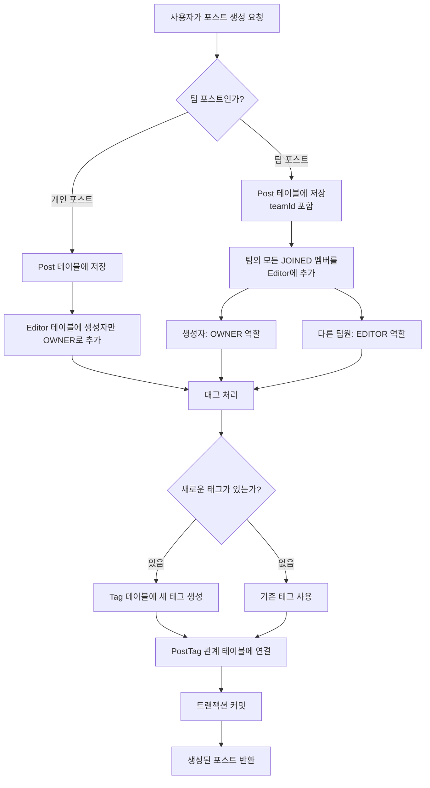
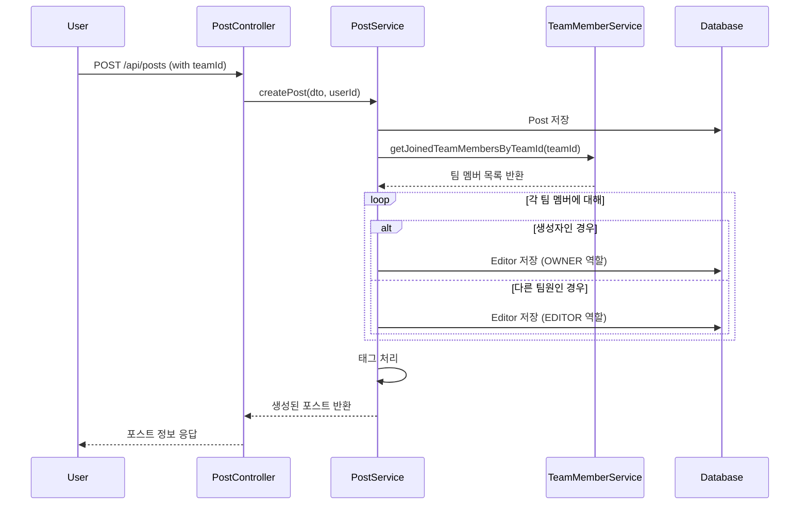
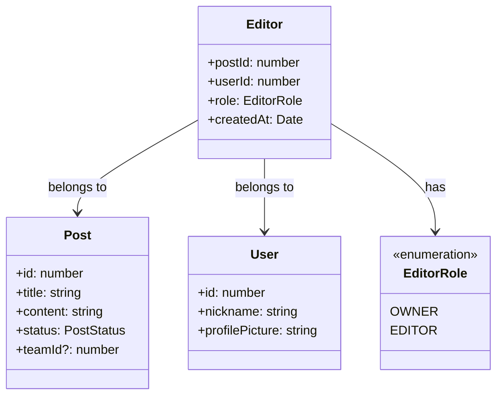
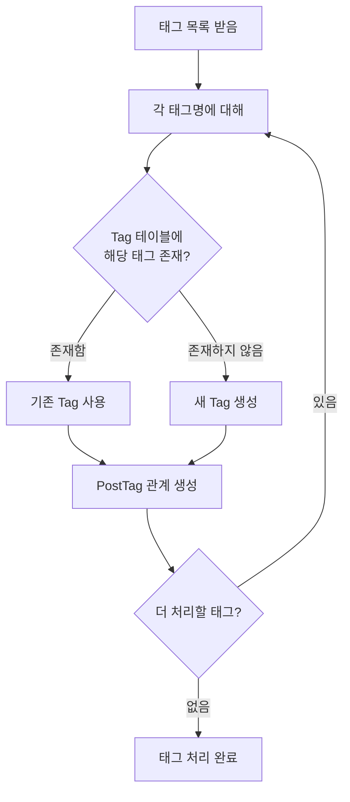
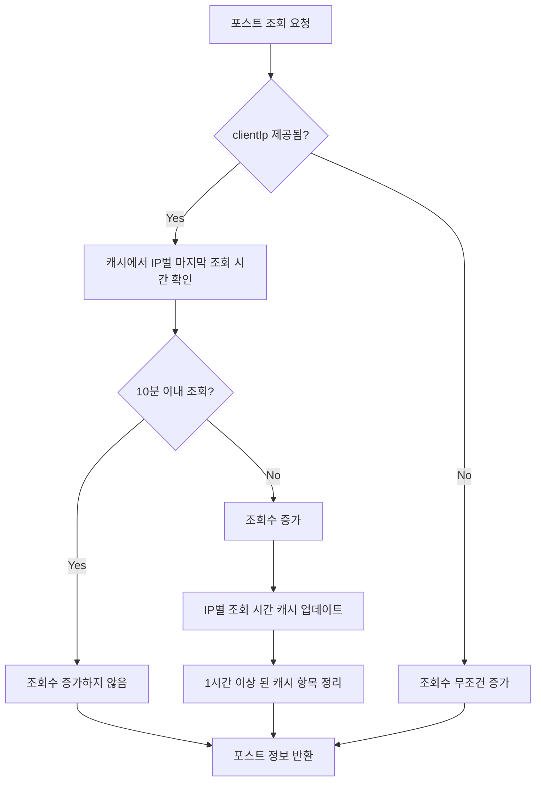
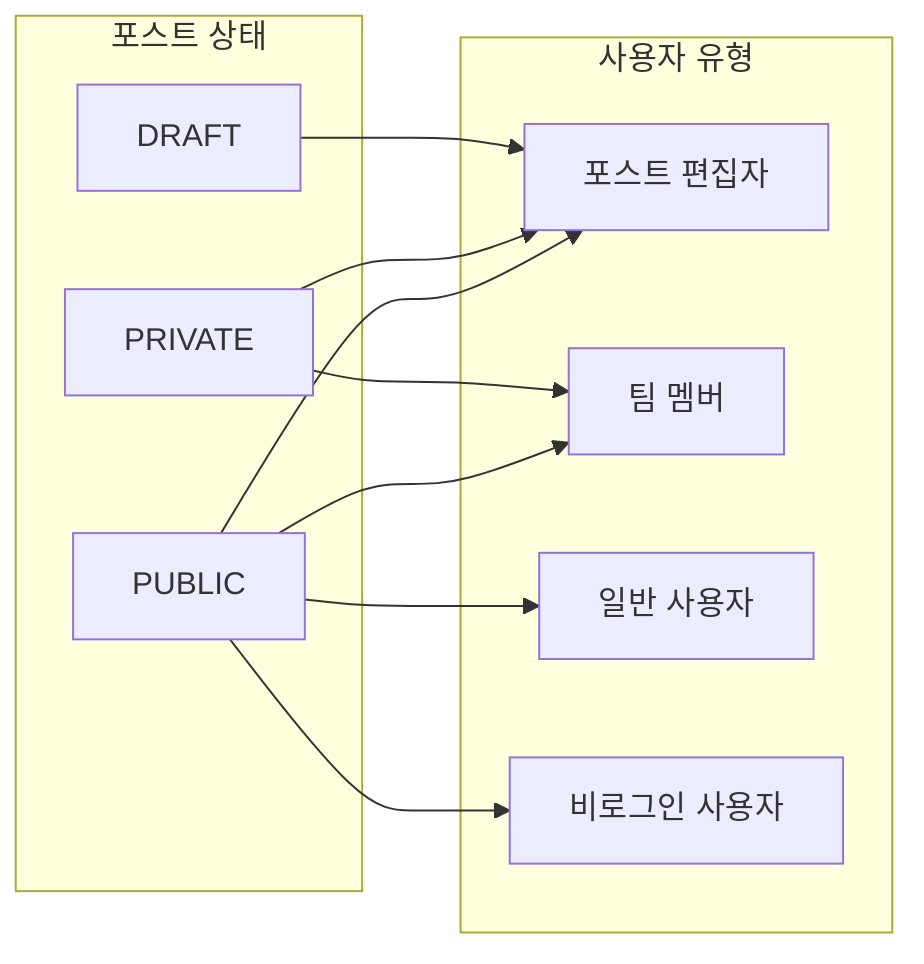
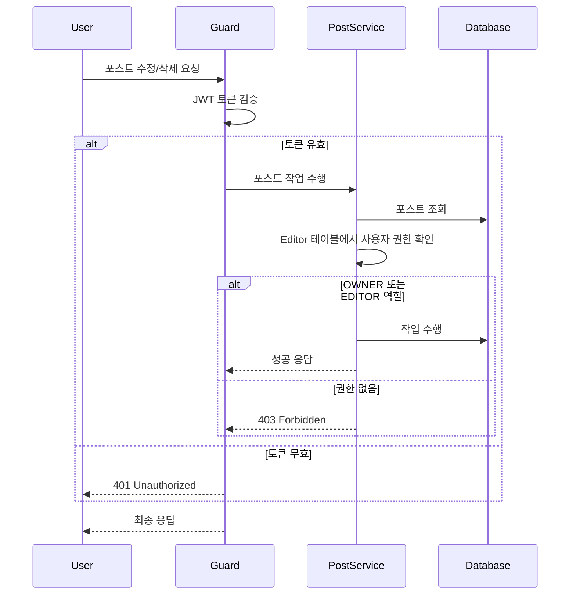

# Post Management System Pipeline

> 포스트 생성, 수정, 삭제 및 팀 협업 시스템의 전체 플로우를 정의합니다.

## 📋 목차

- [시스템 개요](#시스템-개요)
- [포스트 생성 플로우](#포스트-생성-플로우)
- [팀 포스트 시스템](#팀-포스트-시스템)
- [Editor 시스템](#editor-시스템)
- [태그 관리 시스템](#태그-관리-시스템)
- [포스트 조회 시스템](#포스트-조회-시스템)
- [권한 관리](#권한-관리)

---

## 시스템 개요

TULOG의 포스트 관리 시스템은 개인 블로그와 팀 블로그를 동시에 지원하는 하이브리드 구조입니다.

### 핵심 특징

- **다중 편집자 지원**: 한 포스트를 여러 사용자가 편집 가능
- **팀 협업**: 팀 포스트는 팀원 모두가 자동으로 편집자가 됨
- **상태 관리**: PUBLIC, PRIVATE, DRAFT 상태 지원
- **태그 시스템**: 자동 태그 생성 및 관리
- **조회수 관리**: IP 기반 중복 조회 방지

---

## 포스트 생성 플로우

### 트랜잭션 처리

모든 포스트 생성은 다음 순서로 트랜잭션 내에서 처리됩니다:

1. **Post 엔티티 생성**
2. **Editor 관계 설정**
3. **Tag 생성/연결**
4. **트랜잭션 커밋**

실패 시 모든 변경사항이 롤백됩니다.

---

## 팀 포스트 시스템

### 팀 포스트 생성 시퀀스

### 팀 멤버십 변경 시 Editor 업데이트

현재는 포스트 생성 시점의 팀 멤버만 Editor에 추가되며, 이후 팀 멤버십 변경은 자동 반영되지 않습니다.

**향후 개선 사항:**
- 팀 멤버 추가 시 기존 팀 포스트의 Editor에도 자동 추가
- 팀 멤버 제거 시 해당 사용자의 Editor 권한 제거

---

## Editor 시스템

### Editor 역할 정의

### 권한 매트릭스

| 작업 | OWNER | EDITOR | 비편집자 |
|------|-------|--------|----------|
| 포스트 조회 | ✅ | ✅ | 상태에 따라 |
| 포스트 수정 | ✅ | ✅ | ❌ |
| 포스트 삭제 | ✅ | ✅ | ❌ |
| Editor 추가/제거 | ✅ | ❌ | ❌ |

---

## 태그 관리 시스템

### 태그 자동 생성 플로우

### 태그 수정 처리

포스트 수정 시 태그 변경은 다음과 같이 처리됩니다:

1. **기존 PostTag 관계 모두 삭제**
2. **새로운 태그 목록으로 PostTag 재생성**
3. **고아 태그는 유지** (다른 포스트에서 사용 중일 수 있음)

---

## 포스트 조회 시스템

### 조회수 관리

### 캐시 관리

- **캐시 키**: `view:${postId}:${clientIp}`
- **캐시 시간**: 10분 (중복 조회 방지)
- **정리 주기**: 1시간마다 오래된 항목 삭제

---

## 권한 관리

### 포스트 상태별 접근 권한

### 권한 검증 플로우

---

## 🔄 시스템 간 연동

### 팀 관리 시스템과의 연동

1. **팀 멤버 조회**: `TeamMemberService.getJoinedTeamMembersByTeamId()`
2. **팀 정보 포함**: 포스트 응답에 팀 이름 포함
3. **권한 상속**: 팀 멤버십에 따른 포스트 접근 권한

### 사용자 시스템과의 연동

1. **공개 사용자 정보**: `toPublicUser()` 헬퍼 사용
2. **프로필 사진**: 포스트 작성자 정보에 포함
3. **닉네임 표시**: 다중 작성자 지원

---

## 🚀 성능 최적화

### 데이터베이스 최적화

1. **인덱스 전략**:
   - `editor(userId, postId)` 복합 인덱스
   - `post(status, teamId)` 복합 인덱스
   - `post_tag(postId, tagId)` 복합 인덱스

2. **쿼리 최적화**:
   - LEFT JOIN으로 관련 데이터 한 번에 조회
   - 서브쿼리를 통한 페이지네이션

### 메모리 최적화

1. **조회수 캐싱**: Map 기반 인메모리 캐시
2. **캐시 정리**: 정기적 오래된 항목 삭제
3. **메모리 사용량 모니터링**: 캐시 크기 제한 필요

---

## 🔮 향후 개선 계획

### 1. 실시간 협업 기능

- 여러 편집자가 동시에 편집할 때 충돌 방지
- 실시간 편집 상태 표시
- 변경 사항 실시간 동기화

### 2. 포스트 히스토리

- 편집 이력 추적
- 버전 관리 시스템
- 변경 사항 롤백 기능

### 3. 권한 세분화

- 편집자별 세부 권한 설정
- 읽기 전용 편집자 역할
- 승인 기반 편집 플로우

### 4. 태그 관리 고도화

- 태그 통계 및 분석
- 고아 태그 자동 정리
- 태그 자동 추천 시스템

---

_Last Updated: 2025-08-15_  
_Version: 1.0_  
_Key Features: Multi-Editor Support, Team Collaboration, Tag Management, View Count System_