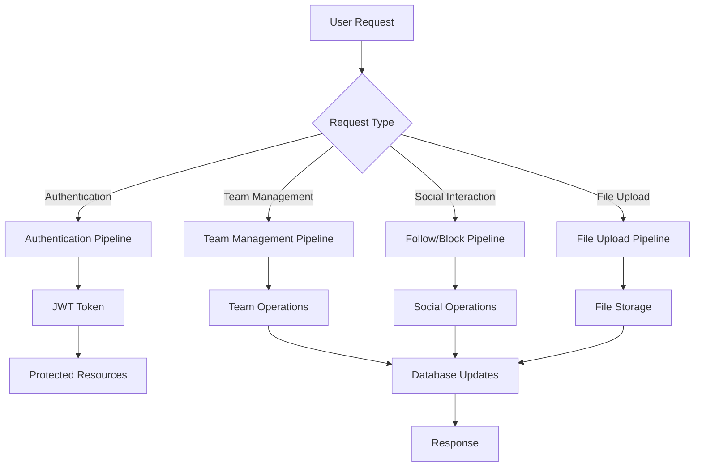
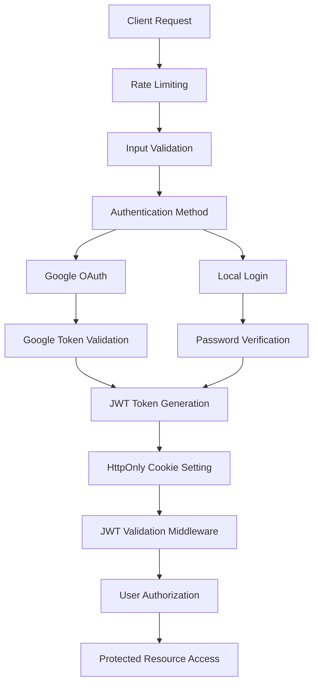

# TULOG Business Logic Pipelines

## 📚 개요

이 디렉토리는 TULOG 서비스의 복잡한 비즈니스 로직을 단계별로 문서화한 파이프라인 문서들을 포함합니다.

## � 파이프라인 목록

### 🔐 인증 시스템 (Authentication System)

| Pipeline                                                   | Description                             | Complexity | Status    |
| ---------------------------------------------------------- | --------------------------------------- | ---------- | --------- |
| [**Google OAuth Login**](./GOOGLE_LOGIN_PIPELINE.md)       | Google 계정을 통한 소셜 로그인          | ⭐⭐⭐     | ✅ Active |
| [**Local Login**](./LOCAL_LOGIN_PIPELINE.md)               | 이메일/비밀번호 기반 회원가입 및 로그인 | ⭐⭐⭐⭐   | ✅ Active |
| [**JWT Authentication**](./JWT_AUTHENTICATION_PIPELINE.md) | 토큰 기반 세션 관리 및 API 인증         | ⭐⭐⭐⭐⭐ | ✅ Active |

### 👥 사용자 관리 시스템 (User Management System)

| Pipeline                                                 | Description                            | Complexity | Status    |
| -------------------------------------------------------- | -------------------------------------- | ---------- | --------- |
| [**Team Management**](./TEAM_MANAGEMENT_PIPELINE.md)     | 팀 생성, 구성원 관리, 권한 제어 시스템 | ⭐⭐⭐⭐⭐ | ✅ Active |
| [**Follow System**](./FOLLOW_SYSTEM_PIPELINE.md)         | 사용자 간 팔로우/언팔로우 관계 관리    | ⭐⭐⭐⭐   | ✅ Active |
| [**User Block System**](./USER_BLOCK_SYSTEM_PIPELINE.md) | 사용자 차단/해제 및 상호작용 제한      | ⭐⭐⭐     | ✅ Active |

### 📁 파일 관리 시스템 (File Management System)

| Pipeline                                                   | Description                     | Complexity | Status    |
| ---------------------------------------------------------- | ------------------------------- | ---------- | --------- |
| [**File Upload System**](./FILE_UPLOAD_SYSTEM_PIPELINE.md) | 타입별 파일 업로드 및 저장 관리 | ⭐⭐⭐     | ✅ Active |

---

## 🔄 전체 시스템 흐름도



## 🏗️ 복잡도 분석

### 시스템 복잡도 매트릭스

| 기능              | 데이터 무결성 | 비즈니스 규칙 | 보안 요구사항 | 성능 요구사항 | 총 복잡도  |
| ----------------- | ------------- | ------------- | ------------- | ------------- | ---------- |
| **JWT 인증**      | ⭐⭐⭐⭐⭐    | ⭐⭐⭐        | ⭐⭐⭐⭐⭐    | ⭐⭐⭐⭐      | ⭐⭐⭐⭐⭐ |
| **팀 관리**       | ⭐⭐⭐⭐⭐    | ⭐⭐⭐⭐⭐    | ⭐⭐⭐        | ⭐⭐⭐        | ⭐⭐⭐⭐⭐ |
| **로컬 로그인**   | ⭐⭐⭐⭐      | ⭐⭐⭐⭐      | ⭐⭐⭐⭐      | ⭐⭐⭐        | ⭐⭐⭐⭐   |
| **팔로우 시스템** | ⭐⭐⭐⭐      | ⭐⭐⭐        | ⭐⭐          | ⭐⭐⭐⭐      | ⭐⭐⭐⭐   |
| **Google OAuth**  | ⭐⭐⭐        | ⭐⭐⭐        | ⭐⭐⭐⭐      | ⭐⭐⭐        | ⭐⭐⭐     |
| **사용자 차단**   | ⭐⭐⭐        | ⭐⭐⭐        | ⭐⭐⭐        | ⭐⭐          | ⭐⭐⭐     |
| **파일 업로드**   | ⭐⭐          | ⭐⭐          | ⭐⭐⭐        | ⭐⭐⭐        | ⭐⭐⭐     |

### 주요 특징별 분류

#### 높은 복잡도 (⭐⭐⭐⭐⭐)

-   **JWT 인증**: 토큰 생명주기, 보안, 성능 최적화
-   **팀 관리**: 복잡한 비즈니스 규칙, 트랜잭션 관리

#### 중간 복잡도 (⭐⭐⭐⭐)

-   **로컬 로그인**: 이메일 인증, 비밀번호 보안
-   **팔로우 시스템**: 데이터 정합성, 대용량 처리

#### 낮은 복잡도 (⭐⭐⭐)

-   **Google OAuth**: 외부 서비스 의존
-   **사용자 차단**: 단순한 상태 관리
-   **파일 업로드**: 기본적인 파일 처리

## 🚀 성능 특성

### 처리 시간 비교

| Pipeline        | 평균 응답시간 | 데이터베이스 쿼리 | 외부 의존성   |
| --------------- | ------------- | ----------------- | ------------- |
| JWT 검증        | ~50-100ms     | 1개               | 없음          |
| 팀 생성         | ~200-500ms    | 3-5개             | 없음          |
| 팔로우/언팔로우 | ~100-200ms    | 2-3개             | 없음          |
| 사용자 차단     | ~100-200ms    | 2-3개             | 없음          |
| 파일 업로드     | ~500-2000ms   | 0개               | 파일시스템    |
| Google 로그인   | ~2-4초        | 2-3개             | Google API    |
| 로컬 로그인     | ~1-2초        | 3-4개             | 이메일 서비스 |

## 📊 비즈니스 가치

### 핵심 가치 제공

#### 🔐 보안 & 신뢰성

-   **다층 인증**: OAuth + 로컬 + JWT 통합 보안
-   **데이터 보호**: 사용자 정보 및 상호작용 보안
-   **접근 제어**: 세밀한 권한 관리

#### 👥 사용자 경험

-   **소셜 기능**: 팔로우, 팀 참여를 통한 커뮤니티 형성
-   **개인화**: 차단, 팔로우를 통한 맞춤형 경험
-   **멀티미디어**: 프로필/팀 이미지로 풍부한 표현

#### 🚀 확장성 & 유지보수성

-   **모듈화**: 독립적인 파이프라인으로 유지보수 용이
-   **성능 최적화**: 각 기능별 최적화된 처리
-   **확장 가능**: 새로운 기능 추가 용이

## 📚 문서 활용 가이드

### 개발자용

1. **새 기능 개발**: 기존 파이프라인 패턴 참고
2. **버그 수정**: 해당 파이프라인 플로우 차트 활용
3. **성능 최적화**: 복잡도 분석 결과 참고

### 아키텍처 설계용

1. **시스템 설계**: 전체 흐름도 및 복잡도 매트릭스 참고
2. **기술 선택**: 성능 특성 비교표 활용
3. **확장 계획**: 각 파이프라인의 확장 가능성 섹션 참고

### 운영팀용

1. **모니터링**: 성능 메트릭 및 에러 처리 가이드 활용
2. **장애 대응**: 각 파이프라인별 예외 상황 대응 방안 참고
3. **용량 계획**: 처리 시간 및 리소스 사용량 데이터 활용

---

## 🏗️ System Architecture

### Authentication Components

```
┌─────────────────────────────────────────────────────────────┐
│                    TULOG Authentication System              │
├─────────────────────────────────────────────────────────────┤
│                                                             │
│  ┌─────────────┐  ┌─────────────┐  ┌─────────────┐         │
│  │   Google    │  │    Local    │  │     JWT     │         │
│  │   OAuth     │  │   Login     │  │    Auth     │         │
│  │  Pipeline   │  │  Pipeline   │  │  Pipeline   │         │
│  └─────────────┘  └─────────────┘  └─────────────┘         │
│         │                │                │                │
│         └────────────────┼────────────────┘                │
│                          │                                 │
│  ┌─────────────────────────────────────────────────────────┐ │
│  │              Authentication Service                     │ │
│  └─────────────────────────────────────────────────────────┘ │
│                          │                                 │
│  ┌─────────────────────────────────────────────────────────┐ │
│  │                Database Layer                           │ │
│  │  ┌─────────┐ ┌─────────┐ ┌─────────────┐ ┌─────────┐   │ │
│  │  │  User   │ │  Auth   │ │ PendingUser │ │ Session │   │ │
│  │  │ Entity  │ │ Entity  │ │   Entity    │ │  Store  │   │ │
│  │  └─────────┘ └─────────┘ └─────────────┘ └─────────┘   │ │
│  └─────────────────────────────────────────────────────────┘ │
└─────────────────────────────────────────────────────────────┘
```

---

## 📊 Pipeline Comparison

### Feature Matrix

| Feature                 | Google OAuth      | Local Login           | JWT Auth        |
| ----------------------- | ----------------- | --------------------- | --------------- |
| **User Registration**   | ✅ Automatic      | ✅ Email Verification | ❌ N/A          |
| **Password Management** | ❌ N/A            | ✅ bcrypt             | ❌ N/A          |
| **Social Integration**  | ✅ Google         | ❌ N/A                | ❌ N/A          |
| **Email Verification**  | ❌ Auto-verified  | ✅ Required           | ❌ N/A          |
| **Session Management**  | ✅ JWT Cookies    | ✅ JWT Cookies        | ✅ Core Feature |
| **Token Refresh**       | ✅ 7-day Refresh  | ✅ 7-day Refresh      | ✅ Core Feature |
| **Rate Limiting**       | ✅ OAuth requests | ✅ Login attempts     | ❌ N/A          |
| **Security Level**      | ⭐⭐⭐⭐          | ⭐⭐⭐⭐⭐            | ⭐⭐⭐⭐⭐      |

### Performance Characteristics

| Metric                    | Google OAuth       | Local Login       | JWT Auth     |
| ------------------------- | ------------------ | ----------------- | ------------ |
| **Registration Time**     | ~3-5 seconds       | ~2-10 minutes     | N/A          |
| **Login Time**            | ~2-4 seconds       | ~1-2 seconds      | ~50-100ms    |
| **Database Queries**      | 2-3 queries        | 3-4 queries       | 1 query      |
| **External Dependencies** | Google APIs        | Email Service     | None         |
| **Offline Capability**    | ❌ Requires Google | ❌ Requires Email | ✅ Stateless |

---

## 🔒 Security Implementation

### Security Layers



### Security Features by Pipeline

#### Google OAuth Security

-   **OAuth 2.0 Protocol**: Industry standard
-   **Google's Security**: Leverages Google's security infrastructure
-   **No Password Storage**: Zero password-related vulnerabilities
-   **Provider Validation**: Prevents account hijacking

#### Local Login Security

-   **bcrypt Hashing**: Salt rounds 10
-   **Email Verification**: Two-step registration
-   **Password Policy**: Complex password requirements
-   **Rate Limiting**: Brute force protection

#### JWT Authentication Security

-   **Token Separation**: Access/Refresh token strategy
-   **HttpOnly Cookies**: XSS protection
-   **Short Token Lifespan**: 15-minute access tokens
-   **Type Validation**: Token type checking

---

## 📈 Usage Patterns

### Typical User Journeys

#### New User (Google OAuth)

```
1. Click "Google로 로그인" → 2-3 seconds
2. Google OAuth consent → 5-10 seconds
3. Account creation → 1-2 seconds
4. Redirect to app → 1 second
Total: ~10-15 seconds
```

#### New User (Local Registration)

```
1. Fill registration form → 30-60 seconds
2. Submit registration → 2-3 seconds
3. Check email → 1-5 minutes
4. Enter verification code → 10-30 seconds
5. Account activation → 1-2 seconds
6. Login → 1-2 seconds
Total: ~3-8 minutes
```

#### Returning User (Any Method)

```
1. Automatic login (if token valid) → 100ms
2. Or manual login → 1-3 seconds
3. Token refresh (if needed) → 200-500ms
```

---

## 🚨 Error Handling Strategy

### Error Categories

#### Authentication Errors (4xx)

```typescript
// 401 Unauthorized
- Missing or invalid tokens
- Expired access tokens
- User not found
- Account deactivated

// 403 Forbidden
- Inactive user attempting protected actions
- Insufficient permissions
- Admin-only resource access

// 409 Conflict
- Email already exists
- Nickname already taken
- Provider mismatch
```

#### Server Errors (5xx)

```typescript
// 500 Internal Server Error
- Database connection failures
- Email service failures
- JWT signing failures
- Transaction rollback scenarios
```

### Error Recovery Patterns

#### Client-side Recovery

```javascript
// Automatic token refresh on 401
if (response.status === 401) {
    await refreshToken();
    return retryRequest();
}

// Graceful degradation on service failures
if (response.status >= 500) {
    showOfflineMode();
    queueRequestForRetry();
}
```

#### Server-side Recovery

```typescript
// Database transaction rollback
try {
    await queryRunner.commitTransaction();
} catch (error) {
    await queryRunner.rollbackTransaction();
    throw new InternalServerErrorException("Operation failed");
}

// Email service fallback
try {
    await primaryEmailService.send();
} catch (error) {
    await fallbackEmailService.send();
}
```

---

## 📊 Monitoring & Analytics

### Key Metrics

#### Authentication Metrics

-   **Registration Success Rate**: Target >95%
-   **Login Success Rate**: Target >98%
-   **Token Refresh Rate**: Monitor for anomalies
-   **Session Duration**: Average session length

#### Performance Metrics

-   **Authentication Latency**: Target <200ms
-   **Database Query Time**: Target <50ms
-   **Email Delivery Time**: Target <5 seconds
-   **Token Generation Time**: Target <10ms

#### Security Metrics

-   **Failed Login Attempts**: Monitor for attacks
-   **Suspicious Activity**: Geographic anomalies
-   **Token Expiration Events**: Normal vs forced
-   **Account Lockout Events**: Frequency tracking

### Logging Strategy

```typescript
// Authentication Events
logger.info("User login attempt", {
    userId: user.id,
    method: "google|local",
    ip: req.ip,
    userAgent: req.headers["user-agent"],
    timestamp: new Date().toISOString(),
});

// Security Events
logger.warn("Suspicious login attempt", {
    email: loginDto.email,
    ip: req.ip,
    failureReason: "multiple_failed_attempts",
    timestamp: new Date().toISOString(),
});

// Performance Events
logger.debug("JWT validation completed", {
    userId: user.id,
    validationTime: `${Date.now() - startTime}ms`,
    tokenType: "access",
    timestamp: new Date().toISOString(),
});
```

---

## 🔧 Configuration Management

### Environment-based Configuration

#### Development

```env
# Relaxed security for development
JWT_SECRET=dev_secret_key
COOKIE_SECURE=false
RATE_LIMIT_ENABLED=false
LOG_LEVEL=debug
```

#### Staging

```env
# Production-like security
JWT_SECRET=staging_secret_key_256_bits
COOKIE_SECURE=true
RATE_LIMIT_ENABLED=true
LOG_LEVEL=info
```

#### Production

```env
# Maximum security
JWT_SECRET=super_secure_production_key_256_bits_minimum
JWT_REFRESH_SECRET=different_super_secure_refresh_key
COOKIE_SECURE=true
COOKIE_SAME_SITE=strict
RATE_LIMIT_ENABLED=true
LOG_LEVEL=warn
```

---

## 🚀 Future Roadmap

### Short-term Improvements (1-3 months)

1. **Redis Integration**: Move email codes and session data to Redis
2. **Enhanced Logging**: Structured logging with correlation IDs
3. **Rate Limiting Enhancement**: Dynamic rate limiting based on behavior
4. **Email Templates**: Professional email design and templates

### Medium-term Improvements (3-6 months)

1. **Token Blacklist**: Implement JWT token blacklisting
2. **Multi-device Management**: Session management across devices
3. **2FA Integration**: Two-factor authentication support
4. **Social Login Expansion**: Kakao, Naver, GitHub integration

### Long-term Improvements (6-12 months)

1. **Advanced Security**: Behavioral analytics and anomaly detection
2. **Microservice Architecture**: Split authentication into dedicated service
3. **Zero-trust Security**: Continuous authentication validation
4. **Compliance**: GDPR, SOC2 compliance implementation

---

## 📚 Additional Resources

### Related Documentation

-   [API Specification](../api-specification/README.md)
-   [Security Guidelines](../SECURITY.md)
-   [Guards Documentation](../GUARDS.md)
-   [Middleware Documentation](../MIDDLEWARE.md)

### External References

-   [JWT Best Practices](https://tools.ietf.org/html/rfc7519)
-   [OAuth 2.0 Security](https://tools.ietf.org/html/rfc6819)
-   [OWASP Authentication Guide](https://owasp.org/www-project-cheat-sheets/cheatsheets/Authentication_Cheat_Sheet.html)
-   [NestJS Authentication](https://docs.nestjs.com/security/authentication)

### Development Tools

-   [JWT Debugger](https://jwt.io/)
-   [Postman Collection](../postman/TULOG_Authentication.json)
-   [OpenAPI Specification](../api-specification/openapi.yaml)

---

**Last Updated**: January 15, 2025  
**Version**: 2.0.0  
**Maintainer**: TULOG Development Team
