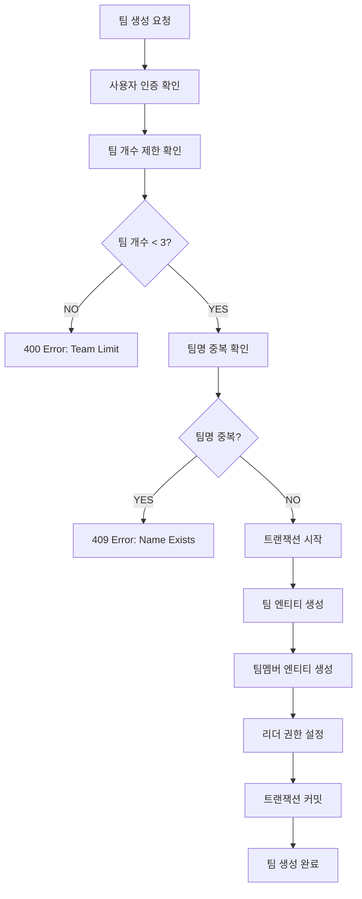
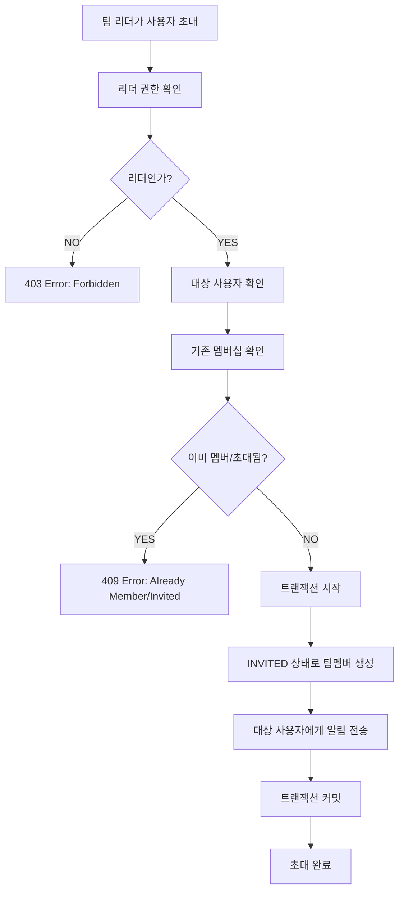
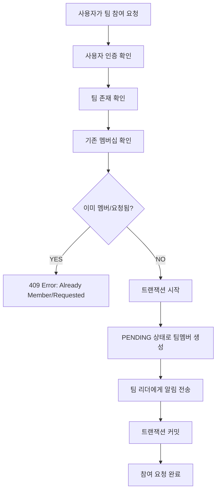
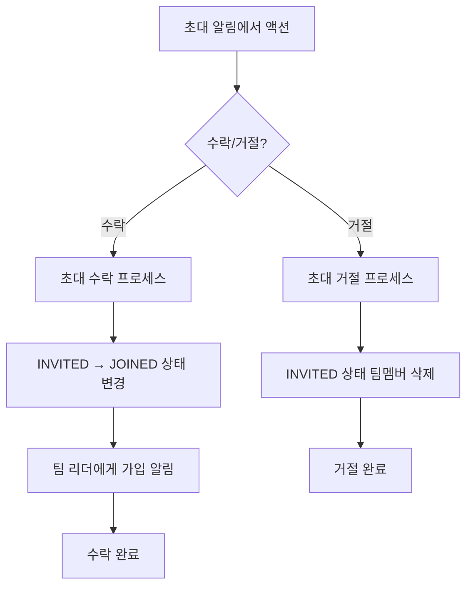
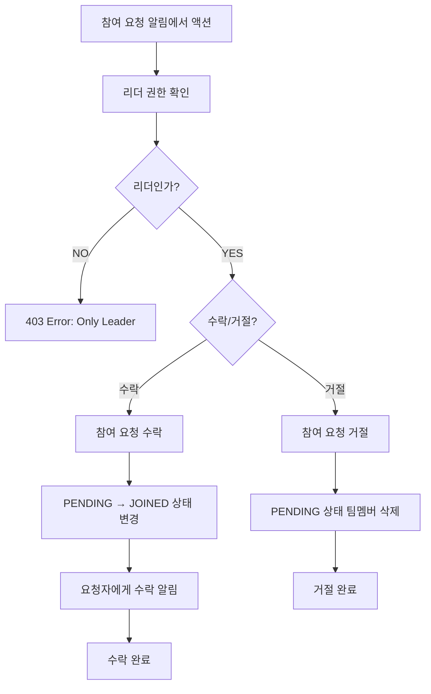
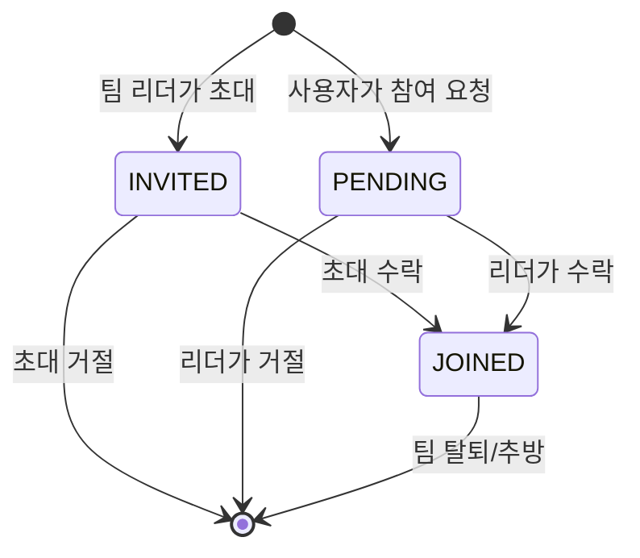
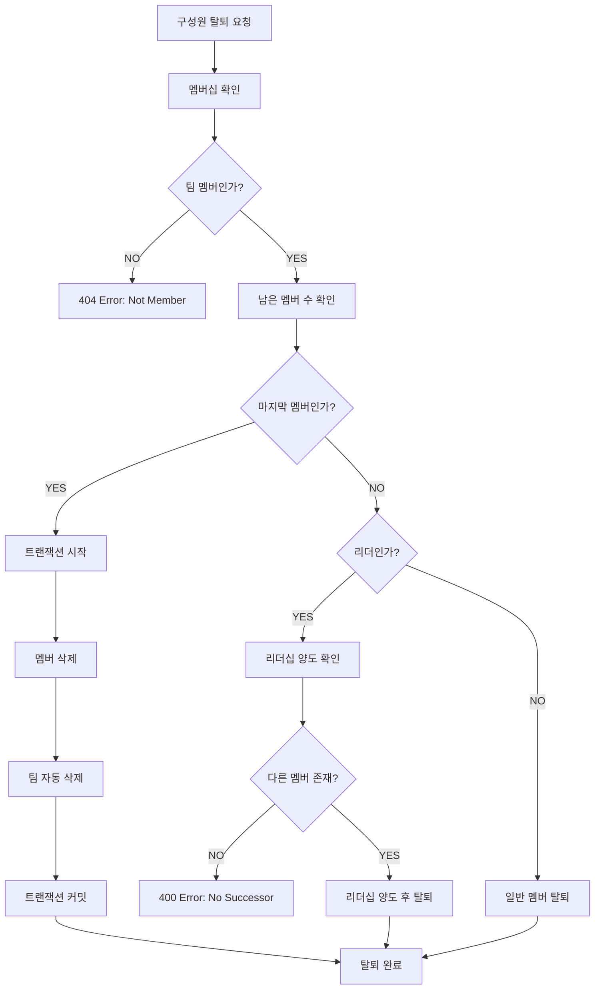

# Team Management Pipeline

## 🏗️ 시스템 개요

팀 관리 시스템은 TULOG의 가장 복잡한 비즈니스 로직 중 하나로, 팀 생성, 구성원 관리, 권한 제어, 자동 삭제 등의 복잡한 규칙을 관리합니다.

### 📋 핵심 기능

-   **팀 생성 & 삭제**: 사용자당 최대 3개 팀 제한
-   **구성원 관리**: 초대, 가입, 탈퇴, 추방 시스템
-   **리더십 관리**: 리더 권한 및 양도 시스템
-   **자동 정리**: 마지막 구성원 탈퇴시 팀 자동 삭제
-   **트랜잭션 보장**: 데이터 무결성 보장

---

## 🎯 비즈니스 규칙

### 팀 생성 제한

```typescript
// 사용자당 최대 3개 팀까지만 생성 가능
const existingTeamsCount = await this.teamRepository.countByUserId(userId);
if (existingTeamsCount >= 3) {
    throw new BadRequestException("You can only create up to 3 teams");
}
```

### 팀명 고유성

```typescript
// 활성 팀 중에서 팀명은 고유해야 함
const existingTeam = await this.teamRepository.findByName(name);
if (existingTeam) {
    throw new ConflictException("Team name already exists");
}
```

### 리더 권한

-   팀 생성자가 자동으로 리더가 됨
-   리더만 구성원 추방 가능
-   마지막 구성원이 나갈 때 팀 자동 삭제

---

## 🔄 팀 생성 파이프라인



### 상세 구현

```typescript
async createTeam(userId: number, createTeamDto: CreateTeamDto): Promise<Team> {
    // 1. 사용자 존재 확인
    await this.userService.getUserById(userId);

    // 2. 팀 개수 제한 확인 (최대 3개)
    const existingTeamsCount = await this.teamRepository.countByUserId(userId);
    if (existingTeamsCount >= 3) {
        throw new BadRequestException('You can only create up to 3 teams');
    }

    // 3. 팀명 중복 확인
    const existingTeam = await this.teamRepository.findByName(createTeamDto.name);
    if (existingTeam) {
        throw new ConflictException('Team name already exists');
    }

    // 4. 트랜잭션으로 팀과 팀멤버 동시 생성
    return await this.dataSource.transaction(async manager => {
        // 팀 생성
        const team = await this.teamRepository.create(createTeamDto, manager);

        // 생성자를 리더로 팀멤버 추가
        await this.teamMemberService.addMemberWithTransaction(
            team.id, userId, TeamRole.LEADER, manager
        );

        return team;
    });
}
```

---

## 👥 팀 구성원 관리 파이프라인

### 팀 초대 시스템 (Team Invitation)



#### 초대 상세 구현

```typescript
async inviteToTeam(leaderId: number, teamId: number, memberId: number): Promise<TeamMember> {
    return await this.dataSource.transaction(async (manager) => {
        // 1. 리더 권한 확인
        const isLeader = await this.isTeamLeader(teamId, leaderId);
        if (!isLeader) {
            throw new ConflictException('Only team leaders can invite members.');
        }

        // 2. 초대 대상 사용자 확인
        const invitedUser = await this.userService.getUserById(memberId);

        // 3. 기존 멤버십 확인
        const existingMember = await this.teamMemberRepository.findOneByPrimaryKey(teamId, memberId);
        if (existingMember) {
            throw new ConflictException('User is already a team member or invited.');
        }

        // 4. INVITED 상태로 팀멤버 생성
        const invitation = await this.teamMemberRepository.inviteTeam(teamId, memberId);

        // 5. 초대 알림 전송
        const team = await this.teamRepository.findById(teamId);
        await this.noticeService.createTeamInviteNotice(
            memberId,
            teamId,
            team.name,
            'System'
        );

        return invitation;
    });
}
```

### 팀 참여 요청 시스템 (Team Join Request)



#### 참여 요청 상세 구현

```typescript
async requestToTeam(memberId: number, teamId: number): Promise<TeamMember> {
    return await this.dataSource.transaction(async (manager) => {
        // 1. 팀 존재 확인
        const team = await this.teamRepository.findById(teamId);
        if (!team) {
            throw new NotFoundException('Team not found.');
        }

        // 2. 기존 멤버십 확인
        const existingMember = await this.teamMemberRepository.findOneByPrimaryKey(teamId, memberId);
        if (existingMember) {
            throw new ConflictException('Already a member or request pending.');
        }

        // 3. PENDING 상태로 팀멤버 생성
        const newTeamMember = await this.teamMemberRepository.requestToTeam(teamId, memberId);

        // 4. 팀 리더에게 알림 전송
        const teamMembers = await this.teamMemberRepository.getTeamMembersByTeamId(teamId);
        const leader = teamMembers.find((tm: TeamMember) => tm.isLeader);

        if (leader) {
            const requesterUser = await this.userService.getUserById(memberId);
            await this.noticeService.createTeamJoinNotice(
                Number((leader as any).memberId),
                teamId,
                team.name,
                requesterUser.nickname,
            );
        }

        return newTeamMember;
    });
}
```

### 알림 기반 팀 관리 액션

#### 팀 초대 수락/거절



#### 팀 참여 요청 수락/거절 (리더만)



### 팀멤버 상태 관리

#### 상태 다이어그램



#### 상태별 설명

| 상태      | 설명                      | 다음 가능한 액션                     |
| --------- | ------------------------- | ------------------------------------ |
| `INVITED` | 리더가 초대한 상태        | 수락(→JOINED), 거절(→삭제)           |
| `PENDING` | 사용자가 참여 요청한 상태 | 리더 수락(→JOINED), 리더 거절(→삭제) |
| `JOINED`  | 정식 팀원 상태            | 탈퇴, 추방                           |

### 구성원 탈퇴 프로세스

### 구성원 탈퇴 프로세스



### 상세 구현

```typescript
async leaveMember(teamId: number, userId: number): Promise<void> {
    // 1. 멤버십 확인
    const member = await this.teamMemberRepository.findByTeamAndUser(teamId, userId);
    if (!member) {
        throw new NotFoundException('You are not a member of this team');
    }

    // 2. 트랜잭션으로 안전한 탈퇴 처리
    await this.dataSource.transaction(async manager => {
        // 3. 남은 멤버 수 확인
        const remainingCount = await this.teamMemberRepository.countByTeamId(teamId, manager);

        if (remainingCount === 1) {
            // 마지막 멤버: 팀 자동 삭제
            await this.teamMemberRepository.deleteByTeamAndUser(teamId, userId, manager);
            await this.teamRepository.delete(teamId, manager);
        } else if (member.role === TeamRole.LEADER) {
            // 리더 탈퇴: 리더십 양도 필요
            const otherMembers = await this.teamMemberRepository.findOtherMembers(teamId, userId, manager);
            if (otherMembers.length === 0) {
                throw new BadRequestException('Cannot leave as leader without transferring leadership');
            }

            // 첫 번째 멤버에게 리더십 양도
            await this.teamMemberRepository.updateRole(
                teamId, otherMembers[0].userId, TeamRole.LEADER, manager
            );
            await this.teamMemberRepository.deleteByTeamAndUser(teamId, userId, manager);
        } else {
            // 일반 멤버 탈퇴
            await this.teamMemberRepository.deleteByTeamAndUser(teamId, userId, manager);
        }
    });
}
```

---

## 🛡️ 권한 관리 시스템

### 리더 권한 확인

```typescript
async validateLeaderPermission(teamId: number, userId: number): Promise<void> {
    const member = await this.teamMemberRepository.findByTeamAndUser(teamId, userId);

    if (!member) {
        throw new NotFoundException('You are not a member of this team');
    }

    if (member.role !== TeamRole.LEADER) {
        throw new ForbiddenException('Only team leader can perform this action');
    }
}
```

### 멤버십 확인

```typescript
async validateMembership(teamId: number, userId: number): Promise<TeamMember> {
    const member = await this.teamMemberRepository.findByTeamAndUser(teamId, userId);

    if (!member) {
        throw new NotFoundException('You are not a member of this team');
    }

    return member;
}
```

---

## 🚨 에러 처리 및 예외 상황

### 주요 비즈니스 예외

| 에러 코드 | 상황                  | 메시지                                                 |
| --------- | --------------------- | ------------------------------------------------------ |
| `400`     | 팀 생성 개수 초과     | You can only create up to 3 teams                      |
| `400`     | 리더십 양도 없이 탈퇴 | Cannot leave as leader without transferring leadership |
| `403`     | 리더 권한 없음        | Only team leader can perform this action               |
| `404`     | 팀 멤버 아님          | You are not a member of this team                      |
| `409`     | 팀명 중복             | Team name already exists                               |
| `409`     | 이미 팀 멤버          | User is already a team member                          |

### 데이터 무결성 보장

```typescript
// 트랜잭션으로 원자성 보장
await this.dataSource.transaction(async (manager) => {
    // 복수의 데이터베이스 작업을 하나의 트랜잭션으로 처리
    // 실패시 자동 롤백
});
```

---

## 📊 성능 및 최적화

### 쿼리 최적화

-   **인덱스 활용**: 팀명, 사용자ID에 대한 복합 인덱스
-   **JOIN 최적화**: 필요한 경우에만 관계 데이터 로드
-   **카운트 쿼리**: 개수 확인용 전용 쿼리 사용

### 메모리 효율성

-   **지연 로딩**: 관계 데이터는 필요시에만 로드
-   **트랜잭션 범위 최소화**: 필요한 작업만 트랜잭션에 포함

---

## 🔮 확장 가능성

### 향후 개선 사항

1. **팀 용량 제한**: 팀당 최대 멤버 수 제한
2. **역할 세분화**: 관리자, 일반 멤버 등 세부 역할
3. **초대 시스템**: 이메일 기반 팀 초대
4. **팀 아카이브**: 삭제 대신 아카이브 기능
5. **활동 로그**: 팀 내 활동 추적 시스템

### 확장성 고려사항

-   **수평 확장**: 팀 데이터 샤딩 준비
-   **캐싱 전략**: 자주 조회되는 팀 정보 캐싱
-   **이벤트 기반**: 팀 변경사항 이벤트 발행

---

## 📝 요약

팀 관리 시스템은 다음과 같은 복잡한 비즈니스 규칙을 구현합니다:

1. **제한된 리소스**: 사용자당 최대 3개 팀
2. **권한 기반 접근**: 리더만 특정 작업 수행 가능
3. **자동 정리**: 빈 팀 자동 삭제로 데이터 정합성 유지
4. **트랜잭션 보장**: 복잡한 상태 변경의 원자성 보장
5. **예외 처리**: 다양한 비즈니스 규칙 위반 상황 대응

이러한 복잡성으로 인해 팀 관리는 TULOG 서비스의 핵심 비즈니스 로직 중 하나입니다.
