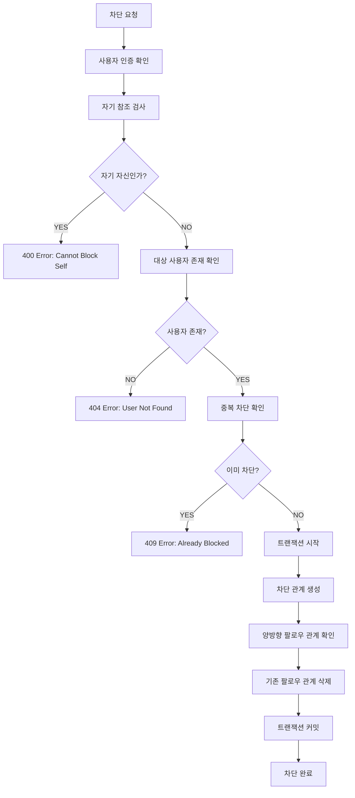
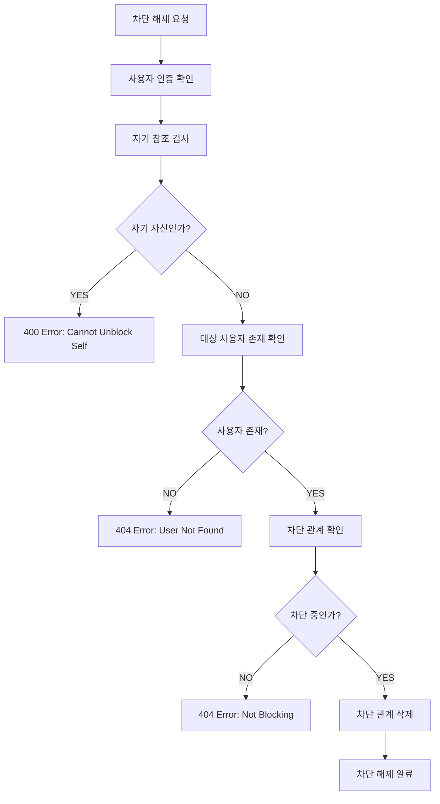
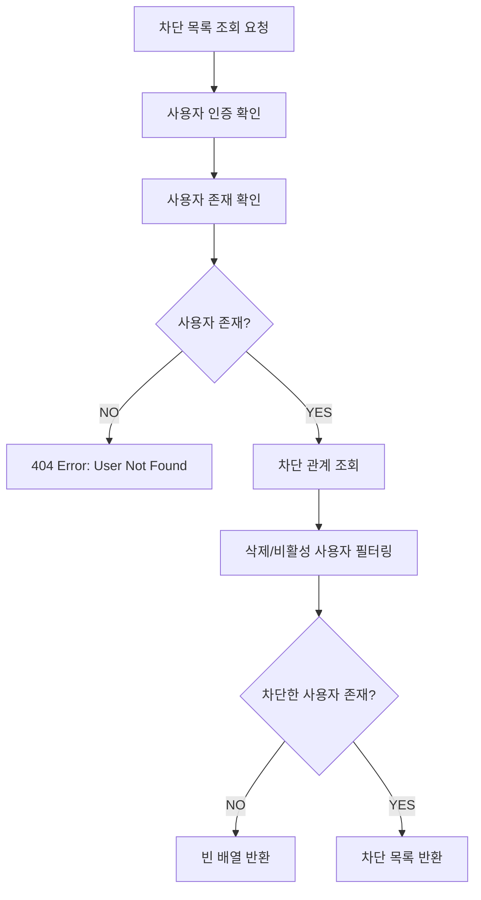

# User Block System Pipeline

## 🏗️ 시스템 개요

사용자 차단 시스템은 TULOG의 안전한 소셜 환경을 유지하기 위한 핵심 보안 기능입니다. 사용자 간의 상호작용을 제한하고 불쾌한 경험을 방지합니다.

### 📋 핵심 기능

-   **사용자 차단**: 특정 사용자와의 모든 상호작용 차단
-   **차단 해제**: 차단된 사용자와의 관계 복원
-   **차단 목록 관리**: 차단한 사용자 목록 조회
-   **상호작용 제한**: 차단된 사용자와의 팔로우, 댓글 등 제한
-   **자기 보호**: 자기 자신 차단 방지

---

## 🎯 비즈니스 규칙

### 차단 제약사항

```typescript
// 자기 자신은 차단할 수 없음
if (blockerId === blockedId) {
    throw new BadRequestException("Cannot block yourself.");
}

// 이미 차단한 사용자는 중복 차단 불가
if (isBlocking) {
    throw new ConflictException("User is already blocked.");
}
```

### 차단 효과

-   **팔로우 관계**: 기존 팔로우 관계 자동 해제 (양방향)
-   **상호작용**: 댓글, 좋아요 등 모든 상호작용 차단
-   **가시성**: 게시물 및 프로필 상호 비가시화
-   **알림**: 차단된 사용자로부터의 알림 차단
-   **트랜잭션 보장**: 차단과 팔로우 해제의 원자적 처리

### 데이터 정합성

```typescript
// 삭제된 사용자는 차단 목록에서 자동 제외
.andWhere('blockedUser.deletedAt IS NULL AND blockedUser.isActive = true')
```

---

## 🔄 사용자 차단 파이프라인



### 상세 구현

```typescript
async blockUser(blockerId: number, blockedId: number): Promise<UserBlock> {
    // 1. 자기 자신 차단 방지
    if (blockerId === blockedId) {
        throw new BadRequestException('Cannot block yourself.');
    }

    // 2. 차단 대상 사용자 존재 확인 (활성 사용자만)
    await this.userService.getUserById(blockedId);

    // 3. 중복 차단 확인
    const isBlocking = await this.userBlockRepository.isBlocking(blockerId, blockedId);
    if (isBlocking) {
        throw new ConflictException('User is already blocked.');
    }

    // 4. 트랜잭션으로 차단과 팔로우 해제를 원자적으로 처리
    return await this.dataSource.transaction(async (manager) => {
        // 4-1. 차단 관계 생성
        const blockRelation = await this.userBlockRepository.blockUserWithTransaction(
            blockerId,
            blockedId,
            manager,
        );

        // 4-2. 양방향 팔로우 관계 확인 및 삭제
        // 차단하는 사용자가 차단당하는 사용자를 팔로우하는지 확인
        const isBlockerFollowingBlocked = await this.followRepository.isFollowingWithManager(
            blockerId,
            blockedId,
            manager,
        );
        if (isBlockerFollowingBlocked) {
            await this.followRepository.unfollowUserWithTransaction(
                blockerId,
                blockedId,
                manager,
            );
        }

        // 차단당하는 사용자가 차단하는 사용자를 팔로우하는지 확인
        const isBlockedFollowingBlocker = await this.followRepository.isFollowingWithManager(
            blockedId,
            blockerId,
            manager,
        );
        if (isBlockedFollowingBlocker) {
            await this.followRepository.unfollowUserWithTransaction(
                blockedId,
                blockerId,
                manager,
            );
        }

        return blockRelation;
    });
}
```

---

## 🔄 트랜잭션 기반 데이터 무결성

### 원자적 처리 보장

```typescript
// 트랜잭션을 사용하여 차단과 팔로우 해제를 원자적으로 처리
return await this.dataSource.transaction(async (manager) => {
    // 모든 작업이 성공하거나 모두 실패 (롤백)
    // 1. 차단 관계 생성
    // 2. 양방향 팔로우 관계 확인 및 삭제
    // 실패 시 자동 롤백으로 데이터 일관성 보장
});
```

### 트랜잭션 메서드 구현

```typescript
// UserBlockRepository 트랜잭션 메서드
async blockUserWithTransaction(
    blockerId: number,
    blockedId: number,
    manager: EntityManager,
): Promise<UserBlock> {
    const block = manager.getRepository(UserBlock).create({ blockerId, blockedId });
    return await manager.getRepository(UserBlock).save(block);
}

// FollowRepository 트랜잭션 메서드
async unfollowUserWithTransaction(
    followerId: number,
    followingId: number,
    manager: EntityManager,
): Promise<boolean> {
    await manager.getRepository(Follow).delete({ followerId, followingId });
    return true;
}
```

---

## 🔄 차단 해제 파이프라인



### 상세 구현

```typescript
async unblockUser(blockerId: number, blockedId: number): Promise<boolean> {
    // 1. 자기 자신 차단 해제 방지
    if (blockerId === blockedId) {
        throw new BadRequestException('You cannot block yourself');
    }

    // 2. 차단 해제 대상 사용자 존재 확인
    await this.userService.getUserById(blockedId);

    // 3. 차단 관계 존재 확인
    const isBlocking = await this.userBlockRepository.isBlocking(blockerId, blockedId);
    if (!isBlocking) {
        throw new ConflictException('You are not blocking this user');
    }

    // 4. 차단 관계 삭제
    return await this.userBlockRepository.unblockUser(blockerId, blockedId);
}
```

---

## 📋 차단 목록 조회 파이프라인



### 상세 구현

```typescript
async getBlockUsers(userId: number): Promise<User[] | null> {
    // 1. 요청 사용자 존재 확인
    await this.userService.getUserById(userId);

    // 2. 차단 관계 조회 (활성 사용자만)
    const user = await this.userService.findUserWithBlockedById(userId);

    // 3. 차단한 사용자가 없으면 빈 배열 반환
    if (!user) {
        return [];
    }

    // 4. 차단한 사용자 목록 추출 및 반환
    return user.blockers.map((b) => b.blocked);
}
```

### 복잡한 쿼리 로직

```typescript
// Repository 레벨에서 삭제/비활성 사용자 자동 필터링
async findUserWithBlockedById(id: number): Promise<User | null> {
    return await this.userRepository
        .createQueryBuilder('user')
        .leftJoinAndSelect('user.blockers', 'block')
        .leftJoinAndSelect('block.blocked', 'blockedUser')
        .where('user.id = :id', { id })
        .andWhere('user.deletedAt IS NULL AND user.isActive = true')
        .andWhere('blockedUser.deletedAt IS NULL AND blockedUser.isActive = true')
        .getOne();
}
```

---

## 🛡️ 보안 및 상호작용 제한

### 차단 효과 적용

```typescript
// API 레벨에서 차단 관계 확인
async checkBlockRelation(userId: number, targetId: number): Promise<boolean> {
    return await this.userBlockRepository.isBlockedByEither(userId, targetId);
}

// 상호작용 가능 여부 확인
async canInteract(userId: number, targetId: number): Promise<boolean> {
    const isBlocked = await this.checkBlockRelation(userId, targetId);
    return !isBlocked;
}
```

### 차단된 사용자와의 상호작용 방지

```typescript
// 댓글 작성 전 차단 관계 확인
async createComment(userId: number, postId: number, content: string) {
    const post = await this.postService.getPostById(postId);

    // 게시물 작성자와 차단 관계 확인
    const canInteract = await this.blockService.canInteract(userId, post.authorId);
    if (!canInteract) {
        throw new ForbiddenException('Cannot interact with blocked user');
    }

    // 댓글 생성 로직...
}
```

### 게시물 가시성 제어

```typescript
// 게시물 목록에서 차단된 사용자 게시물 제외
async getPostList(userId: number): Promise<Post[]> {
    return await this.postRepository
        .createQueryBuilder('post')
        .leftJoin('post.author', 'author')
        .leftJoin('user_block', 'block',
            '(block.blockerId = :userId AND block.blockedId = author.id) OR ' +
            '(block.blockedId = :userId AND block.blockerId = author.id)'
        )
        .where('block.id IS NULL') // 차단 관계가 없는 게시물만
        .setParameter('userId', userId)
        .getMany();
}
```

---

## 🚨 에러 처리 및 예외 상황

### 주요 비즈니스 예외

| 에러 코드 | 상황                      | 메시지                         |
| --------- | ------------------------- | ------------------------------ |
| `400`     | 자기 자신 차단 시도       | Cannot block yourself          |
| `400`     | 자기 자신 차단 해제 시도  | You cannot block yourself      |
| `404`     | 존재하지 않는 사용자      | User with ID {id} not found    |
| `404`     | 차단하지 않은 사용자 해제 | Block record not found         |
| `409`     | 이미 차단한 사용자        | User is already blocked        |
| `409`     | 차단하지 않은 사용자 해제 | You are not blocking this user |

### 예외 처리 전략

```typescript
// 차단 관련 모든 작업에서 일관된 예외 처리
try {
    await this.blockService.blockUser(blockerId, blockedId);
    return { success: true, message: "User blocked successfully" };
} catch (error) {
    if (error instanceof BadRequestException) {
        // 자기 자신 차단 등 잘못된 요청
        return { success: false, error: error.message };
    } else if (error instanceof ConflictException) {
        // 이미 차단된 사용자 등 상태 충돌
        return { success: false, error: error.message };
    }
    // 기타 예외 처리...
}
```

---

## 📊 성능 최적화

### 인덱스 최적화

```typescript
// 차단 관계 조회를 위한 복합 인덱스
@Index(['blockerId', 'blockedId'])
@Index(['blockedId', 'blockerId']) // 양방향 조회 최적화
```

### 쿼리 최적화

```typescript
// 상호 차단 관계 확인을 위한 최적화된 쿼리
async isBlockedByEither(userId1: number, userId2: number): Promise<boolean> {
    const count = await this.repository
        .createQueryBuilder('block')
        .where(
            '(block.blockerId = :userId1 AND block.blockedId = :userId2) OR ' +
            '(block.blockerId = :userId2 AND block.blockedId = :userId1)'
        )
        .setParameters({ userId1, userId2 })
        .getCount();

    return count > 0;
}
```

### 캐싱 전략

```typescript
// 자주 조회되는 차단 관계 캐싱
@Cacheable('user-blocks', 300) // 5분 캐시
async getBlockedUsers(userId: number): Promise<number[]> {
    return await this.userBlockRepository.getBlockedUserIds(userId);
}
```

---

## 🔄 UI/UX 연동

### 실시간 차단 상태 반영

```typescript
// 프론트엔드에서 차단 상태 관리
const [isBlocked, setIsBlocked] = useState<boolean>(false);

// 차단 상태 확인
useEffect(() => {
    const checkBlockStatus = async () => {
        const response = await checkIfBlocked(targetUserId);
        setIsBlocked(response.isBlocked);
    };

    if (targetUserId) {
        checkBlockStatus();
    }
}, [targetUserId]);
```

### 사용자 경험 개선

```typescript
// 차단된 사용자 프로필 접근 시 적절한 메시지 표시
if (isBlocked) {
    return (
        <div className="blocked-user-message">
            <p>This user is not available.</p>
        </div>
    );
}
```

---

## 🔮 확장 가능성

### 향후 개선 사항

1. **임시 차단**: 일정 기간 후 자동 해제되는 임시 차단
2. **차단 사유**: 차단 이유 카테고리화 및 통계
3. **관리자 개입**: 신고 기반 강제 차단 시스템
4. **화이트리스트**: 중요한 공지사항 등은 차단 무시
5. **차단 알림**: 상대방에게 차단 사실 알림 (선택적)

### 시스템 통합

-   **신고 시스템**: 신고와 차단의 연계 처리
-   **모더레이션**: 관리자 도구와의 통합
-   **분석 시스템**: 차단 패턴 분석 및 어뷰징 탐지

---

## 📝 요약

사용자 차단 시스템은 다음과 같은 복잡한 비즈니스 로직을 구현합니다:

1. **안전한 환경**: 불쾌한 상호작용 차단으로 안전한 소셜 환경 조성
2. **데이터 무결성**: 트랜잭션 기반 원자적 처리로 데이터 일관성 보장
3. **양방향 팔로우 해제**: 차단 시 모든 팔로우 관계 자동 정리
4. **성능 최적화**: 인덱스 최적화 및 캐싱을 통한 빠른 조회
5. **포괄적 제한**: 팔로우, 댓글, 게시물 등 모든 상호작용 차단

이러한 복잡성으로 인해 차단 시스템은 안전한 소셜 플랫폼 운영의 핵심 보안 기능입니다.
